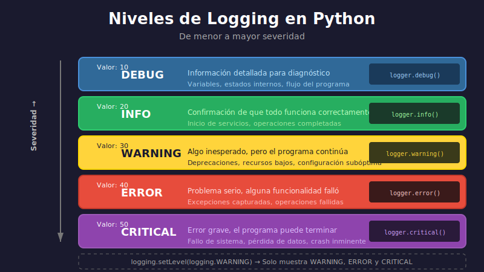

# 🐛 Debugging y Logging

## 📋 Contenido

1. [Técnicas de debugging](#1-técnicas-de-debugging)
2. [pdb - Python Debugger](#2-pdb---python-debugger)
3. [Debugging en VS Code](#3-debugging-en-vs-code)
4. [El módulo logging](#4-el-módulo-logging)
5. [Configuración de logging](#5-configuración-de-logging)

---

## 1. Técnicas de Debugging

### Print Debugging (Básico)

```python
def calculate_total(items: list[dict]) -> float:
    total = 0
    print(f"DEBUG: Starting with {len(items)} items")  # Debug

    for item in items:
        print(f"DEBUG: Processing {item}")  # Debug
        subtotal = item["price"] * item["quantity"]
        print(f"DEBUG: Subtotal = {subtotal}")  # Debug
        total += subtotal

    print(f"DEBUG: Final total = {total}")  # Debug
    return total

# ❌ Problemas:
# - Hay que eliminar los prints después
# - No se pueden activar/desactivar fácilmente
# - No hay niveles de severidad
```

### Assert para Validación

```python
def divide(a: float, b: float) -> float:
    assert b != 0, "Divisor cannot be zero"
    assert isinstance(a, (int, float)), f"Expected number, got {type(a)}"
    return a / b

# Los asserts se pueden desactivar con python -O
```

### Breakpoint (Python 3.7+)

```python
def process_data(data: list) -> list:
    results = []
    for item in data:
        breakpoint()  # Pausa aquí y abre pdb
        processed = transform(item)
        results.append(processed)
    return results
```

---

## 2. pdb - Python Debugger

### Iniciar pdb

```python
# Método 1: breakpoint()
def my_function():
    x = 10
    breakpoint()  # Pausa aquí
    y = x + 5
    return y

# Método 2: import pdb
def my_function():
    import pdb; pdb.set_trace()
    x = 10
    return x

# Método 3: Desde línea de comandos
# python -m pdb my_script.py
```

### Comandos Básicos de pdb

| Comando | Abreviación | Descripción |
|---------|-------------|-------------|
| `help` | `h` | Muestra ayuda |
| `next` | `n` | Ejecutar siguiente línea (sin entrar a funciones) |
| `step` | `s` | Ejecutar siguiente línea (entrando a funciones) |
| `continue` | `c` | Continuar hasta próximo breakpoint |
| `list` | `l` | Mostrar código alrededor |
| `print expr` | `p expr` | Imprimir expresión |
| `pp expr` | | Pretty print |
| `where` | `w` | Mostrar stack trace |
| `up` | `u` | Subir un nivel en el stack |
| `down` | `d` | Bajar un nivel en el stack |
| `quit` | `q` | Salir del debugger |

### Ejemplo Interactivo

```python
def find_bug(numbers: list[int]) -> int:
    total = 0
    for i, num in enumerate(numbers):
        breakpoint()  # Pausa aquí
        total += num * i
    return total

# Al ejecutar:
# > /path/to/file.py(4)find_bug()
# -> total += num * i
# (Pdb) p num
# 10
# (Pdb) p i
# 0
# (Pdb) p total
# 0
# (Pdb) n
# (Pdb) p total
# 0
# (Pdb) c
```

### Breakpoints Condicionales

```python
def process_items(items: list[dict]) -> None:
    for item in items:
        # Solo pausar si el precio es mayor a 100
        if item["price"] > 100:
            breakpoint()

        process(item)

# O usando pdb directamente:
# (Pdb) break my_file.py:10, price > 100
```

### Post-mortem Debugging

```python
# Debuggear después de una excepción
import pdb

try:
    result = buggy_function()
except Exception:
    pdb.post_mortem()  # Abre pdb en el punto de la excepción

# O desde la línea de comandos:
# python -m pdb -c continue my_script.py
# (ejecuta hasta que hay excepción, luego abre pdb)
```

---

## 3. Debugging en VS Code

### Configuración Básica

```json
// .vscode/launch.json
{
    "version": "0.2.0",
    "configurations": [
        {
            "name": "Python: Current File",
            "type": "debugpy",
            "request": "launch",
            "program": "${file}",
            "console": "integratedTerminal"
        },
        {
            "name": "Python: pytest",
            "type": "debugpy",
            "request": "launch",
            "module": "pytest",
            "args": ["-v", "${file}"],
            "console": "integratedTerminal"
        }
    ]
}
```

### Breakpoints en VS Code

- **Click** en el margen izquierdo para agregar breakpoint
- **Click derecho** para breakpoint condicional
- **F5** para iniciar debugging
- **F10** para step over (next)
- **F11** para step into (step)
- **Shift+F11** para step out
- **F5** para continue

### Debug Console

```python
# En la Debug Console puedes:
# - Evaluar expresiones
# - Modificar variables
# - Llamar funciones

# Ejemplo durante debugging:
>>> len(items)
5
>>> items[0]
{'name': 'test', 'price': 100}
>>> items[0]['price'] = 50  # Modificar en tiempo real
```

---

## 4. El Módulo logging

### ¿Por qué logging?

```python
# ❌ print() tiene limitaciones
print("Debug: processing item")  # No se puede desactivar fácilmente
print("Error: something failed")  # No hay niveles

# ✅ logging es profesional
import logging
logging.debug("Processing item")    # Se puede desactivar
logging.error("Something failed")   # Niveles claros
```

### Niveles de Logging



| Nivel | Valor | Uso |
|-------|-------|-----|
| `DEBUG` | 10 | Información detallada para debugging |
| `INFO` | 20 | Confirmación de que las cosas funcionan |
| `WARNING` | 30 | Algo inesperado, pero el programa sigue |
| `ERROR` | 40 | Error que impide una función |
| `CRITICAL` | 50 | Error grave, el programa puede terminar |

### Uso Básico

```python
import logging

# Configuración básica
logging.basicConfig(level=logging.DEBUG)

# Usar los diferentes niveles
logging.debug("Variable x = %s", x)
logging.info("Proceso iniciado")
logging.warning("Archivo no encontrado, usando default")
logging.error("No se pudo conectar a la base de datos")
logging.critical("Sistema sin memoria!")
```

### Formato de Mensajes

```python
import logging

# Formato básico
logging.basicConfig(
    level=logging.DEBUG,
    format="%(asctime)s - %(name)s - %(levelname)s - %(message)s"
)

logging.info("Mensaje de prueba")
# 2026-01-02 10:30:45,123 - root - INFO - Mensaje de prueba

# Formato personalizado
logging.basicConfig(
    format="[%(levelname)s] %(filename)s:%(lineno)d - %(message)s"
)

logging.error("Algo falló")
# [ERROR] my_script.py:15 - Algo falló
```

### Atributos Disponibles para Formato

| Atributo | Descripción |
|----------|-------------|
| `%(asctime)s` | Fecha y hora |
| `%(name)s` | Nombre del logger |
| `%(levelname)s` | Nivel (DEBUG, INFO, etc.) |
| `%(message)s` | El mensaje |
| `%(filename)s` | Nombre del archivo |
| `%(lineno)d` | Número de línea |
| `%(funcName)s` | Nombre de la función |
| `%(module)s` | Nombre del módulo |
| `%(pathname)s` | Ruta completa del archivo |

### Loggers Personalizados

```python
import logging

# Crear logger específico para el módulo
logger = logging.getLogger(__name__)
logger.setLevel(logging.DEBUG)

def process_order(order_id: int) -> None:
    logger.info("Processing order %d", order_id)

    try:
        # ... procesar
        logger.debug("Order %d validated", order_id)
    except ValueError as e:
        logger.error("Invalid order %d: %s", order_id, e)
        raise

    logger.info("Order %d completed", order_id)
```

---

## 5. Configuración de Logging

### Handlers

Los **handlers** determinan dónde van los logs.

```python
import logging

logger = logging.getLogger(__name__)
logger.setLevel(logging.DEBUG)

# Handler para consola
console_handler = logging.StreamHandler()
console_handler.setLevel(logging.INFO)

# Handler para archivo
file_handler = logging.FileHandler("app.log")
file_handler.setLevel(logging.DEBUG)

# Formato
formatter = logging.Formatter(
    "%(asctime)s - %(name)s - %(levelname)s - %(message)s"
)
console_handler.setFormatter(formatter)
file_handler.setFormatter(formatter)

# Agregar handlers al logger
logger.addHandler(console_handler)
logger.addHandler(file_handler)

# Ahora los logs van a consola (INFO+) y archivo (DEBUG+)
logger.debug("Solo en archivo")
logger.info("En consola y archivo")
```

### Configuración con Diccionario

```python
import logging
import logging.config

LOGGING_CONFIG = {
    "version": 1,
    "disable_existing_loggers": False,
    "formatters": {
        "standard": {
            "format": "%(asctime)s [%(levelname)s] %(name)s: %(message)s"
        },
        "detailed": {
            "format": "%(asctime)s [%(levelname)s] %(name)s:%(lineno)d - %(message)s"
        },
    },
    "handlers": {
        "console": {
            "class": "logging.StreamHandler",
            "level": "INFO",
            "formatter": "standard",
            "stream": "ext://sys.stdout",
        },
        "file": {
            "class": "logging.FileHandler",
            "level": "DEBUG",
            "formatter": "detailed",
            "filename": "app.log",
            "mode": "a",
        },
    },
    "loggers": {
        "": {  # Root logger
            "handlers": ["console", "file"],
            "level": "DEBUG",
        },
        "my_module": {
            "handlers": ["console"],
            "level": "WARNING",
            "propagate": False,
        },
    },
}

logging.config.dictConfig(LOGGING_CONFIG)
```

### Rotating File Handler

```python
import logging
from logging.handlers import RotatingFileHandler, TimedRotatingFileHandler

# Rotar por tamaño (5 archivos de 1MB máximo)
size_handler = RotatingFileHandler(
    "app.log",
    maxBytes=1_000_000,  # 1 MB
    backupCount=5
)

# Rotar por tiempo (diario, mantener 7 días)
time_handler = TimedRotatingFileHandler(
    "app.log",
    when="midnight",
    interval=1,
    backupCount=7
)

logger = logging.getLogger(__name__)
logger.addHandler(size_handler)
```

### Logging en Tests

```python
# conftest.py
import pytest
import logging

@pytest.fixture(autouse=True)
def setup_logging(caplog):
    """Configurar logging para tests."""
    caplog.set_level(logging.DEBUG)


# test_example.py
def test_function_logs_correctly(caplog):
    """Verificar que la función genera logs correctos."""
    with caplog.at_level(logging.INFO):
        my_function()

    assert "Expected message" in caplog.text
    assert len(caplog.records) == 2
    assert caplog.records[0].levelname == "INFO"
```

### Ejemplo Completo: Aplicación con Logging

```python
# src/config.py
import logging
import logging.config

def setup_logging(debug: bool = False) -> None:
    """Configurar logging para la aplicación."""
    level = logging.DEBUG if debug else logging.INFO

    logging.basicConfig(
        level=level,
        format="%(asctime)s [%(levelname)s] %(name)s: %(message)s",
        handlers=[
            logging.StreamHandler(),
            logging.FileHandler("app.log"),
        ]
    )


# src/services/user_service.py
import logging

logger = logging.getLogger(__name__)

class UserService:
    def create_user(self, name: str, email: str) -> dict:
        logger.info("Creating user: %s", email)

        try:
            # Validación
            if not email or "@" not in email:
                logger.warning("Invalid email format: %s", email)
                raise ValueError("Invalid email")

            # Crear usuario
            user = {"name": name, "email": email}
            logger.debug("User data: %s", user)

            # Guardar (simulado)
            user["id"] = 1
            logger.info("User created with ID: %d", user["id"])

            return user

        except Exception as e:
            logger.error("Failed to create user: %s", e, exc_info=True)
            raise


# src/main.py
from config import setup_logging
from services.user_service import UserService

def main():
    setup_logging(debug=True)
    logger = logging.getLogger(__name__)

    logger.info("Application starting")

    service = UserService()

    try:
        user = service.create_user("Alice", "alice@example.com")
        logger.info("Success: %s", user)
    except Exception:
        logger.critical("Application failed")

    logger.info("Application finished")


if __name__ == "__main__":
    main()
```

### Salida del Ejemplo

```
2026-01-02 10:30:00 [INFO] __main__: Application starting
2026-01-02 10:30:00 [INFO] services.user_service: Creating user: alice@example.com
2026-01-02 10:30:00 [DEBUG] services.user_service: User data: {'name': 'Alice', 'email': 'alice@example.com'}
2026-01-02 10:30:00 [INFO] services.user_service: User created with ID: 1
2026-01-02 10:30:00 [INFO] __main__: Success: {'name': 'Alice', 'email': 'alice@example.com', 'id': 1}
2026-01-02 10:30:00 [INFO] __main__: Application finished
```

---

## 📚 Resumen

| Concepto | Descripción |
|----------|-------------|
| `breakpoint()` | Iniciar debugger interactivo |
| `pdb` | Python Debugger incorporado |
| `n/s/c/q` | next, step, continue, quit en pdb |
| `logging` | Sistema profesional de logs |
| `DEBUG/INFO/WARNING/ERROR/CRITICAL` | Niveles de severidad |
| `Handler` | Destino de los logs (consola, archivo) |
| `Formatter` | Formato de los mensajes |
| `getLogger(__name__)` | Logger específico por módulo |

---

## 🔗 Referencias

- [pdb Documentation](https://docs.python.org/3/library/pdb.html)
- [logging Documentation](https://docs.python.org/3/library/logging.html)
- [logging HOWTO](https://docs.python.org/3/howto/logging.html)
- [VS Code Python Debugging](https://code.visualstudio.com/docs/python/debugging)
