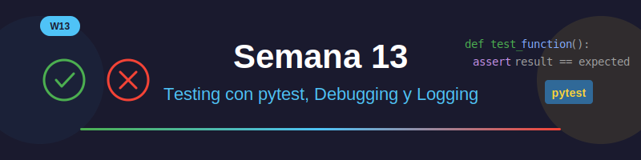

# 🧪 Semana 13: Testing con pytest, Debugging y Logging



## 📋 Descripción

En esta semana aprenderás a escribir **tests automatizados** con pytest, técnicas de **debugging** profesional y sistemas de **logging** para monitorear aplicaciones. Estas habilidades son fundamentales para desarrollar software de calidad.

---

## 🎯 Objetivos de Aprendizaje

Al finalizar esta semana, serás capaz de:

- ✅ Escribir tests unitarios con pytest
- ✅ Usar fixtures para configurar tests
- ✅ Implementar tests parametrizados
- ✅ Aplicar técnicas de debugging efectivas
- ✅ Configurar logging profesional
- ✅ Medir cobertura de código
- ✅ Aplicar Test-Driven Development (TDD)

---

## 📚 Contenido

### 1. Introducción al Testing
- ¿Por qué escribir tests?
- Tipos de tests: unitarios, integración, e2e
- Test-Driven Development (TDD)
- Estructura de un buen test (AAA)

### 2. pytest Básico
- Instalación y configuración
- Escribir tests simples
- Assertions y comparaciones
- Organización de tests

### 3. pytest Avanzado
- Fixtures y conftest.py
- Tests parametrizados
- Markers y filtrado
- Mocking con unittest.mock
- Cobertura con pytest-cov

### 4. Debugging y Logging
- Técnicas de debugging
- Uso de pdb y breakpoints
- Módulo logging
- Configuración de loggers
- Mejores prácticas

---

## 🗂️ Estructura de la Semana

```
week-13/
├── README.md                    # Este archivo
├── rubrica-evaluacion.md        # Criterios de evaluación
├── 0-assets/                    # Recursos visuales
│   ├── week-13-header.svg
│   ├── 01-test-pyramid.svg
│   ├── 02-pytest-flow.svg
│   ├── 03-fixture-scope.svg
│   └── 04-logging-levels.svg
├── 1-teoria/                    # Material teórico
│   ├── 01-intro-testing.md
│   ├── 02-pytest-basico.md
│   ├── 03-pytest-avanzado.md
│   └── 04-debugging-logging.md
├── 2-ejercicios/                # Ejercicios guiados
│   ├── 01-primeros-tests/
│   ├── 02-fixtures-parametrize/
│   └── 03-mocking-coverage/
├── 3-proyecto/                  # Proyecto semanal
│   ├── README.md
│   ├── starter/
│   └── solution/
├── 4-recursos/                  # Material adicional
│   ├── ebooks-free/
│   ├── videografia/
│   └── webgrafia/
└── 5-glosario/                  # Términos clave
    └── README.md
```

---

## ⏱️ Distribución del Tiempo

| Actividad | Tiempo Estimado |
|-----------|-----------------|
| Teoría: Intro y pytest básico | 1.5 horas |
| Teoría: pytest avanzado | 1.5 horas |
| Teoría: Debugging y logging | 1 hora |
| Ejercicios guiados | 1.5 horas |
| Proyecto semanal | 1.5 horas |
| **Total** | **7 horas** |

---

## 📝 Ejercicios

### Ejercicio 01: Primeros Tests
Aprende a escribir tests básicos con pytest y assertions.

### Ejercicio 02: Fixtures y Parametrize
Domina fixtures para setup/teardown y tests parametrizados.

### Ejercicio 03: Mocking y Coverage
Usa mocks para aislar tests y mide la cobertura de código.

---

## 🚀 Proyecto: Suite de Tests para Calculadora Científica

Desarrollarás una **suite de tests completa** para una calculadora científica, aplicando:

- Tests unitarios para cada operación
- Fixtures para configuración
- Tests parametrizados para casos edge
- Mocking para dependencias externas
- Logging para debugging
- Cobertura > 90%

---

## 📌 Entregables

1. **Ejercicios completados** (3 ejercicios)
2. **Proyecto**: Suite de tests con cobertura > 90%
3. **Reporte de cobertura** generado con pytest-cov

---

## ✅ Checklist de la Semana

- [ ] Leer material teórico (4 archivos)
- [ ] Completar Ejercicio 01: Primeros tests
- [ ] Completar Ejercicio 02: Fixtures y parametrize
- [ ] Completar Ejercicio 03: Mocking y coverage
- [ ] Desarrollar proyecto semanal
- [ ] Generar reporte de cobertura
- [ ] Revisar glosario de términos

---

## 🔗 Navegación

| ← Anterior | Inicio | Siguiente → |
|:-----------|:------:|------------:|
| [Semana 12: Decoradores y Regex](../week-12/README.md) | [Índice](../../README.md) | [Semana 14: Proyecto Final](../week-14/README.md) |

---

## 💡 Tips de la Semana

> 💡 **"Write tests. Not too many. Mostly integration."** - Guillermo Rauch

- Empieza con tests simples y ve agregando complejidad
- Un test debe probar una sola cosa
- Los nombres de tests deben describir qué prueban
- Usa fixtures para evitar duplicación
- Ejecuta tests frecuentemente durante el desarrollo
