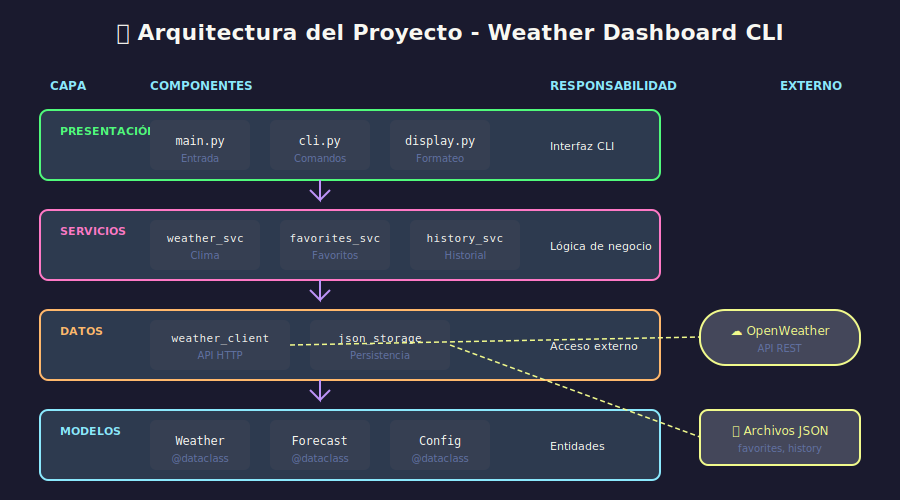

# 🏗️ Arquitectura de Proyectos Python

## 🎯 Objetivos

- Diseñar estructuras de proyecto escalables y mantenibles
- Aplicar principios SOLID en Python
- Organizar código en capas lógicas
- Gestionar configuración y dependencias profesionalmente

---

## 1. Principios de Arquitectura

### 1.1 Separación de Responsabilidades

Cada módulo debe tener **una sola razón para cambiar** (Single Responsibility Principle):

```python
# ❌ MAL: Una clase que hace todo
class WeatherApp:
    def fetch_from_api(self): ...
    def parse_json(self): ...
    def save_to_file(self): ...
    def display_to_user(self): ...
    def validate_input(self): ...

# ✅ BIEN: Responsabilidades separadas
class WeatherClient:
    """Solo se encarga de comunicación con API."""
    def fetch_current(self, city: str) -> dict: ...
    def fetch_forecast(self, city: str) -> dict: ...

class WeatherParser:
    """Solo se encarga de transformar datos."""
    def parse_current(self, data: dict) -> Weather: ...
    def parse_forecast(self, data: dict) -> list[Forecast]: ...

class WeatherDisplay:
    """Solo se encarga de presentación."""
    def show_current(self, weather: Weather) -> None: ...
    def show_forecast(self, forecasts: list[Forecast]) -> None: ...
```

### 1.2 Arquitectura en Capas



```
┌─────────────────────────────────────────┐
│            PRESENTACIÓN (CLI)           │  ← Interacción con usuario
├─────────────────────────────────────────┤
│              SERVICIOS                  │  ← Lógica de negocio
├─────────────────────────────────────────┤
│           ACCESO A DATOS                │  ← API, archivos, DB
├─────────────────────────────────────────┤
│              MODELOS                    │  ← Estructuras de datos
└─────────────────────────────────────────┘
```

**Regla de dependencia**: Las capas superiores dependen de las inferiores, nunca al revés.

---

## 2. Estructura de Proyecto Profesional

### 2.1 Estructura Recomendada

```
weather-dashboard/
├── src/                          # Código fuente
│   ├── __init__.py
│   ├── main.py                   # Punto de entrada
│   ├── cli.py                    # Comandos CLI
│   │
│   ├── api/                      # Capa de acceso a datos externos
│   │   ├── __init__.py
│   │   ├── weather_client.py     # Cliente HTTP
│   │   └── exceptions.py         # Excepciones de API
│   │
│   ├── models/                   # Estructuras de datos
│   │   ├── __init__.py
│   │   ├── weather.py            # Modelo Weather
│   │   └── forecast.py           # Modelo Forecast
│   │
│   ├── services/                 # Lógica de negocio
│   │   ├── __init__.py
│   │   ├── weather_service.py    # Orquesta operaciones
│   │   ├── favorites_service.py  # Gestión de favoritos
│   │   └── history_service.py    # Gestión de historial
│   │
│   ├── storage/                  # Persistencia local
│   │   ├── __init__.py
│   │   ├── json_storage.py       # Almacenamiento JSON
│   │   └── base.py               # Interfaz abstracta
│   │
│   └── utils/                    # Utilidades
│       ├── __init__.py
│       ├── config.py             # Configuración
│       ├── display.py            # Formateo de salida
│       └── validators.py         # Validaciones
│
├── tests/                        # Tests
│   ├── __init__.py
│   ├── conftest.py               # Fixtures compartidas
│   ├── unit/                     # Tests unitarios
│   │   ├── test_weather_client.py
│   │   ├── test_models.py
│   │   └── test_services.py
│   └── integration/              # Tests de integración
│       └── test_cli.py
│
├── data/                         # Datos de la aplicación
│   ├── .gitkeep
│   ├── favorites.json
│   └── history.json
│
├── pyproject.toml                # Configuración del proyecto
├── README.md                     # Documentación
├── .env.example                  # Variables de entorno ejemplo
├── .gitignore                    # Archivos ignorados
└── Dockerfile                    # Containerización (opcional)
```

### 2.2 El Archivo `__init__.py`

Define qué se exporta de cada paquete:

```python
# src/models/__init__.py
"""Modelos de datos del dominio."""
from .weather import Weather, WeatherCondition
from .forecast import Forecast, DailyForecast

__all__ = [
    "Weather",
    "WeatherCondition",
    "Forecast",
    "DailyForecast",
]
```

```python
# Uso desde otros módulos
from src.models import Weather, Forecast  # Limpio y claro
```

---

## 3. Modelos de Datos

### 3.1 Dataclasses para Modelos

```python
# src/models/weather.py
"""Modelos para datos meteorológicos."""
from dataclasses import dataclass, field
from datetime import datetime
from enum import Enum


class WeatherCondition(Enum):
    """Condiciones climáticas posibles."""
    CLEAR = "clear"
    CLOUDS = "clouds"
    RAIN = "rain"
    SNOW = "snow"
    THUNDERSTORM = "thunderstorm"
    MIST = "mist"


@dataclass
class Weather:
    """
    Representa el clima actual de una ubicación.

    Attributes:
        city: Nombre de la ciudad
        country: Código del país (ISO 3166)
        temperature: Temperatura en Celsius
        feels_like: Sensación térmica en Celsius
        humidity: Humedad relativa (%)
        wind_speed: Velocidad del viento (m/s)
        condition: Condición climática
        description: Descripción detallada
        timestamp: Momento de la medición
    """
    city: str
    country: str
    temperature: float
    feels_like: float
    humidity: int
    wind_speed: float
    condition: WeatherCondition
    description: str
    timestamp: datetime = field(default_factory=datetime.now)

    @property
    def is_cold(self) -> bool:
        """Retorna True si la temperatura es menor a 10°C."""
        return self.temperature < 10

    @property
    def is_hot(self) -> bool:
        """Retorna True si la temperatura es mayor a 30°C."""
        return self.temperature > 30

    @classmethod
    def from_api_response(cls, data: dict) -> "Weather":
        """
        Crea una instancia desde la respuesta de OpenWeatherMap.

        Args:
            data: Diccionario con la respuesta de la API

        Returns:
            Instancia de Weather con los datos parseados
        """
        main = data["main"]
        wind = data["wind"]
        weather = data["weather"][0]

        return cls(
            city=data["name"],
            country=data["sys"]["country"],
            temperature=main["temp"],
            feels_like=main["feels_like"],
            humidity=main["humidity"],
            wind_speed=wind["speed"],
            condition=WeatherCondition(weather["main"].lower()),
            description=weather["description"],
        )
```

### 3.2 Inmutabilidad con frozen

```python
@dataclass(frozen=True)
class Coordinates:
    """Coordenadas geográficas inmutables."""
    latitude: float
    longitude: float

    def __post_init__(self) -> None:
        """Valida las coordenadas."""
        if not -90 <= self.latitude <= 90:
            raise ValueError(f"Latitude must be between -90 and 90: {self.latitude}")
        if not -180 <= self.longitude <= 180:
            raise ValueError(f"Longitude must be between -180 and 180: {self.longitude}")
```

---

## 4. Inyección de Dependencias

### 4.1 Por qué es Importante

Permite **desacoplar** componentes y facilita el **testing**:

```python
# ❌ MAL: Dependencia hardcodeada
class WeatherService:
    def __init__(self):
        self.client = WeatherClient()  # Imposible de mockear fácilmente

    def get_weather(self, city: str) -> Weather:
        return self.client.fetch(city)

# ✅ BIEN: Dependencia inyectada
class WeatherService:
    def __init__(self, client: WeatherClient) -> None:
        self.client = client  # Se puede inyectar un mock

    def get_weather(self, city: str) -> Weather:
        return self.client.fetch(city)

# Uso normal
service = WeatherService(WeatherClient(api_key="xxx"))

# En tests
mock_client = Mock(spec=WeatherClient)
service = WeatherService(mock_client)
```

### 4.2 Factory Functions

```python
# src/factory.py
"""Fábricas para crear instancias configuradas."""
from src.api import WeatherClient
from src.services import WeatherService, FavoritesService
from src.storage import JsonStorage
from src.utils.config import Config


def create_weather_service(config: Config) -> WeatherService:
    """
    Crea un WeatherService completamente configurado.

    Args:
        config: Configuración de la aplicación

    Returns:
        Instancia de WeatherService lista para usar
    """
    client = WeatherClient(
        api_key=config.api_key,
        base_url=config.api_base_url,
        timeout=config.api_timeout,
    )
    return WeatherService(client)


def create_favorites_service(config: Config) -> FavoritesService:
    """Crea un FavoritesService con almacenamiento JSON."""
    storage = JsonStorage(config.favorites_file)
    return FavoritesService(storage)
```

---

## 5. Gestión de Configuración

### 5.1 Variables de Entorno

```python
# src/utils/config.py
"""Gestión de configuración de la aplicación."""
import os
from dataclasses import dataclass
from pathlib import Path
from typing import Self


@dataclass
class Config:
    """
    Configuración de la aplicación.

    Lee valores de variables de entorno con valores por defecto.
    """
    api_key: str
    api_base_url: str = "https://api.openweathermap.org/data/2.5"
    api_timeout: int = 10
    data_dir: Path = Path("data")
    log_level: str = "INFO"

    @property
    def favorites_file(self) -> Path:
        """Ruta al archivo de favoritos."""
        return self.data_dir / "favorites.json"

    @property
    def history_file(self) -> Path:
        """Ruta al archivo de historial."""
        return self.data_dir / "history.json"

    @classmethod
    def from_env(cls) -> Self:
        """
        Crea configuración desde variables de entorno.

        Raises:
            ValueError: Si API_KEY no está definida
        """
        api_key = os.getenv("OPENWEATHER_API_KEY")
        if not api_key:
            raise ValueError(
                "OPENWEATHER_API_KEY environment variable is required. "
                "Get your free API key at https://openweathermap.org/api"
            )

        return cls(
            api_key=api_key,
            api_base_url=os.getenv("API_BASE_URL", cls.api_base_url),
            api_timeout=int(os.getenv("API_TIMEOUT", cls.api_timeout)),
            data_dir=Path(os.getenv("DATA_DIR", cls.data_dir)),
            log_level=os.getenv("LOG_LEVEL", cls.log_level),
        )
```

### 5.2 Archivo .env

```bash
# .env.example
# Copia este archivo a .env y completa los valores

# API Key de OpenWeatherMap (obligatorio)
# Obtén tu key gratis en: https://openweathermap.org/api
OPENWEATHER_API_KEY=tu_api_key_aqui

# Configuración opcional
API_BASE_URL=https://api.openweathermap.org/data/2.5
API_TIMEOUT=10
DATA_DIR=data
LOG_LEVEL=INFO
```

### 5.3 Cargar .env automáticamente

```python
# src/main.py
"""Punto de entrada de la aplicación."""
from pathlib import Path


def load_dotenv() -> None:
    """Carga variables de entorno desde .env si existe."""
    env_file = Path(".env")
    if not env_file.exists():
        return

    with open(env_file) as f:
        for line in f:
            line = line.strip()
            if not line or line.startswith("#"):
                continue
            if "=" in line:
                key, value = line.split("=", 1)
                os.environ.setdefault(key.strip(), value.strip())


def main() -> None:
    """Función principal de la aplicación."""
    load_dotenv()

    from src.utils.config import Config
    from src.cli import create_cli

    config = Config.from_env()
    cli = create_cli(config)
    cli.run()


if __name__ == "__main__":
    main()
```

---

## 6. Manejo de Errores Centralizado

### 6.1 Jerarquía de Excepciones

```python
# src/exceptions.py
"""Excepciones personalizadas de la aplicación."""


class WeatherDashboardError(Exception):
    """Excepción base de la aplicación."""
    pass


class ConfigurationError(WeatherDashboardError):
    """Error de configuración."""
    pass


class APIError(WeatherDashboardError):
    """Error de comunicación con API externa."""

    def __init__(self, message: str, status_code: int | None = None):
        super().__init__(message)
        self.status_code = status_code


class CityNotFoundError(APIError):
    """Ciudad no encontrada en la API."""

    def __init__(self, city: str):
        super().__init__(f"City not found: {city}", status_code=404)
        self.city = city


class RateLimitError(APIError):
    """Límite de requests excedido."""

    def __init__(self):
        super().__init__("API rate limit exceeded. Please try again later.", status_code=429)


class StorageError(WeatherDashboardError):
    """Error de almacenamiento."""
    pass
```

### 6.2 Uso en Capas

```python
# src/api/weather_client.py
import requests
from src.exceptions import APIError, CityNotFoundError, RateLimitError


class WeatherClient:
    def fetch_current(self, city: str) -> dict:
        try:
            response = requests.get(
                f"{self.base_url}/weather",
                params={"q": city, "appid": self.api_key, "units": "metric"},
                timeout=self.timeout,
            )
            response.raise_for_status()
            return response.json()

        except requests.exceptions.HTTPError as e:
            if e.response.status_code == 404:
                raise CityNotFoundError(city) from e
            elif e.response.status_code == 429:
                raise RateLimitError() from e
            else:
                raise APIError(f"API error: {e}", e.response.status_code) from e

        except requests.exceptions.Timeout:
            raise APIError("Request timed out") from None

        except requests.exceptions.ConnectionError:
            raise APIError("Could not connect to weather service") from None
```

---

## ✅ Checklist de Arquitectura

- [ ] Código organizado en capas (API, Services, Models, Utils)
- [ ] Cada módulo tiene una sola responsabilidad
- [ ] Dependencias inyectadas (no hardcodeadas)
- [ ] Configuración externalizada (.env)
- [ ] Excepciones personalizadas con jerarquía
- [ ] `__init__.py` exporta símbolos públicos
- [ ] Modelos usan dataclasses con type hints
- [ ] Factory functions para crear objetos complejos

---

## 📚 Recursos Adicionales

- [Python Application Layouts](https://realpython.com/python-application-layouts/)
- [SOLID Principles in Python](https://realpython.com/solid-principles-python/)
- [Clean Architecture in Python](https://www.cosmicpython.com/)
