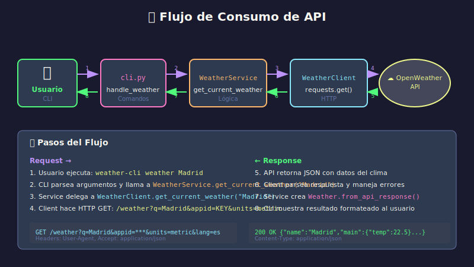

# 🌐 Consumo de APIs con requests

## 🎯 Objetivos

- Dominar la librería requests para consumir APIs REST
- Manejar autenticación, headers y parámetros
- Implementar manejo robusto de errores HTTP
- Aplicar patrones de reintentos y timeouts

---

## 1. Introducción a requests

### 1.1 Instalación

```bash
uv add requests
```

### 1.2 Tu Primera Request

```python
import requests

# GET simple
response = requests.get("https://api.github.com")
print(response.status_code)  # 200
print(response.json())       # Diccionario con datos
```

---

## 2. Métodos HTTP



### 2.1 GET - Obtener Datos

```python
import requests

# GET con parámetros
response = requests.get(
    "https://api.openweathermap.org/data/2.5/weather",
    params={
        "q": "Madrid",
        "appid": "tu_api_key",
        "units": "metric",
        "lang": "es",
    }
)

if response.ok:  # status_code < 400
    data = response.json()
    print(f"Temperatura: {data['main']['temp']}°C")
```

### 2.2 POST - Enviar Datos

```python
# POST con JSON
response = requests.post(
    "https://api.example.com/users",
    json={
        "name": "Ana García",
        "email": "ana@example.com",
    },
    headers={"Authorization": "Bearer token123"}
)

if response.status_code == 201:  # Created
    user = response.json()
    print(f"Usuario creado: {user['id']}")
```

### 2.3 Otros Métodos

```python
# PUT - Actualizar recurso completo
requests.put(url, json={"name": "Nuevo nombre"})

# PATCH - Actualizar parcialmente
requests.patch(url, json={"email": "nuevo@email.com"})

# DELETE - Eliminar recurso
requests.delete(url)
```

---

## 3. Headers y Autenticación

### 3.1 Headers Personalizados

```python
headers = {
    "Authorization": "Bearer mi_token_secreto",
    "Content-Type": "application/json",
    "Accept": "application/json",
    "User-Agent": "WeatherDashboard/1.0",
}

response = requests.get(url, headers=headers)
```

### 3.2 API Key en Query String

```python
# Método común en APIs públicas (como OpenWeatherMap)
response = requests.get(
    "https://api.openweathermap.org/data/2.5/weather",
    params={
        "q": "Barcelona",
        "appid": "tu_api_key",  # API key como parámetro
    }
)
```

### 3.3 Basic Auth

```python
from requests.auth import HTTPBasicAuth

response = requests.get(
    "https://api.example.com/private",
    auth=HTTPBasicAuth("usuario", "contraseña")
)

# O de forma simplificada
response = requests.get(url, auth=("usuario", "contraseña"))
```

---

## 4. Manejo de Respuestas

### 4.1 Propiedades del Response

```python
response = requests.get(url)

# Status
response.status_code    # 200, 404, 500, etc.
response.ok             # True si status < 400
response.reason         # "OK", "Not Found", etc.

# Contenido
response.text           # String (HTML, texto plano)
response.json()         # Diccionario (si es JSON)
response.content        # Bytes (para binarios)

# Headers de respuesta
response.headers        # Dict-like con headers
response.headers["Content-Type"]  # "application/json"

# Metadata
response.url            # URL final (después de redirects)
response.elapsed        # Tiempo que tardó la request
```

### 4.2 Verificación de Status

```python
response = requests.get(url)

# Opción 1: Verificar manualmente
if response.status_code == 200:
    data = response.json()
elif response.status_code == 404:
    print("Recurso no encontrado")
else:
    print(f"Error: {response.status_code}")

# Opción 2: Lanzar excepción automáticamente
try:
    response.raise_for_status()  # Lanza HTTPError si status >= 400
    data = response.json()
except requests.exceptions.HTTPError as e:
    print(f"Error HTTP: {e}")
```

---

## 5. Manejo de Errores

### 5.1 Tipos de Excepciones

```python
import requests
from requests.exceptions import (
    RequestException,      # Base de todas las excepciones
    ConnectionError,       # Error de conexión
    Timeout,              # Request tardó demasiado
    HTTPError,            # Status code >= 400
    TooManyRedirects,     # Demasiados redirects
)

try:
    response = requests.get(url, timeout=10)
    response.raise_for_status()
    return response.json()

except ConnectionError:
    print("No hay conexión a internet")

except Timeout:
    print("La petición tardó demasiado")

except HTTPError as e:
    if e.response.status_code == 404:
        print("Recurso no encontrado")
    elif e.response.status_code == 429:
        print("Demasiadas peticiones, intenta más tarde")
    else:
        print(f"Error del servidor: {e.response.status_code}")

except RequestException as e:
    print(f"Error de red: {e}")
```

### 5.2 Cliente HTTP Robusto

```python
# src/api/weather_client.py
"""Cliente HTTP para OpenWeatherMap API."""
import logging
import requests
from requests.adapters import HTTPAdapter
from urllib3.util.retry import Retry

from src.exceptions import APIError, CityNotFoundError, RateLimitError
from src.models import Weather, Forecast


logger = logging.getLogger(__name__)


class WeatherClient:
    """
    Cliente para consumir la API de OpenWeatherMap.

    Implementa reintentos automáticos, timeouts y manejo
    de errores robusto.

    Attributes:
        api_key: API key de OpenWeatherMap
        base_url: URL base de la API
        timeout: Timeout en segundos para requests
    """

    DEFAULT_BASE_URL = "https://api.openweathermap.org/data/2.5"
    DEFAULT_TIMEOUT = 10

    def __init__(
        self,
        api_key: str,
        base_url: str = DEFAULT_BASE_URL,
        timeout: int = DEFAULT_TIMEOUT,
    ) -> None:
        """
        Inicializa el cliente.

        Args:
            api_key: API key de OpenWeatherMap
            base_url: URL base de la API
            timeout: Timeout para requests en segundos
        """
        self.api_key = api_key
        self.base_url = base_url.rstrip("/")
        self.timeout = timeout
        self._session = self._create_session()

    def _create_session(self) -> requests.Session:
        """
        Crea una sesión HTTP con reintentos configurados.

        Returns:
            Session configurada con retry policy
        """
        session = requests.Session()

        # Configurar reintentos
        retry_strategy = Retry(
            total=3,                    # Máximo 3 reintentos
            backoff_factor=1,           # Espera 1s, 2s, 4s entre reintentos
            status_forcelist=[500, 502, 503, 504],  # Reintentar en estos códigos
        )

        adapter = HTTPAdapter(max_retries=retry_strategy)
        session.mount("http://", adapter)
        session.mount("https://", adapter)

        # Headers por defecto
        session.headers.update({
            "Accept": "application/json",
            "User-Agent": "WeatherDashboard/1.0",
        })

        return session

    def _make_request(self, endpoint: str, params: dict | None = None) -> dict:
        """
        Realiza una petición GET a la API.

        Args:
            endpoint: Endpoint relativo (ej: "/weather")
            params: Parámetros adicionales de query string

        Returns:
            Diccionario con la respuesta JSON

        Raises:
            CityNotFoundError: Si la ciudad no existe
            RateLimitError: Si se excede el límite de requests
            APIError: Para otros errores de API
        """
        url = f"{self.base_url}{endpoint}"

        # Parámetros base
        request_params = {
            "appid": self.api_key,
            "units": "metric",
            "lang": "es",
        }
        if params:
            request_params.update(params)

        logger.debug(f"Making request to {url} with params {request_params}")

        try:
            response = self._session.get(
                url,
                params=request_params,
                timeout=self.timeout,
            )
            response.raise_for_status()
            return response.json()

        except requests.exceptions.HTTPError as e:
            self._handle_http_error(e)

        except requests.exceptions.Timeout:
            logger.error(f"Request to {url} timed out")
            raise APIError("Request timed out. Please try again.")

        except requests.exceptions.ConnectionError:
            logger.error("Connection error occurred")
            raise APIError(
                "Could not connect to weather service. "
                "Please check your internet connection."
            )

    def _handle_http_error(self, error: requests.exceptions.HTTPError) -> None:
        """
        Maneja errores HTTP y lanza excepciones apropiadas.

        Args:
            error: El error HTTP original

        Raises:
            CityNotFoundError: Si status es 404
            RateLimitError: Si status es 429
            APIError: Para otros errores
        """
        status_code = error.response.status_code

        if status_code == 404:
            logger.warning(f"City not found: {error.request.url}")
            raise CityNotFoundError("Unknown") from error

        elif status_code == 401:
            logger.error("Invalid API key")
            raise APIError(
                "Invalid API key. Please check your OPENWEATHER_API_KEY.",
                status_code=401,
            ) from error

        elif status_code == 429:
            logger.warning("Rate limit exceeded")
            raise RateLimitError() from error

        else:
            logger.error(f"API error: {status_code} - {error.response.text}")
            raise APIError(
                f"Weather service error: {error.response.reason}",
                status_code=status_code,
            ) from error

    def get_current_weather(self, city: str) -> Weather:
        """
        Obtiene el clima actual de una ciudad.

        Args:
            city: Nombre de la ciudad (ej: "Madrid" o "Madrid,ES")

        Returns:
            Objeto Weather con los datos actuales

        Raises:
            CityNotFoundError: Si la ciudad no existe
            APIError: Si hay error de API
        """
        logger.info(f"Fetching current weather for {city}")

        try:
            data = self._make_request("/weather", {"q": city})
            return Weather.from_api_response(data)
        except CityNotFoundError:
            raise CityNotFoundError(city)

    def get_forecast(self, city: str, days: int = 5) -> list[Forecast]:
        """
        Obtiene el pronóstico de una ciudad.

        Args:
            city: Nombre de la ciudad
            days: Número de días (máx 5 en plan gratuito)

        Returns:
            Lista de objetos Forecast

        Raises:
            CityNotFoundError: Si la ciudad no existe
            APIError: Si hay error de API
        """
        logger.info(f"Fetching {days}-day forecast for {city}")

        try:
            data = self._make_request("/forecast", {"q": city, "cnt": days * 8})
            return Forecast.from_api_response(data)
        except CityNotFoundError:
            raise CityNotFoundError(city)

    def close(self) -> None:
        """Cierra la sesión HTTP."""
        self._session.close()

    def __enter__(self) -> "WeatherClient":
        """Context manager entry."""
        return self

    def __exit__(self, *args) -> None:
        """Context manager exit."""
        self.close()
```

---

## 6. Sesiones y Rendimiento

### 6.1 Usar Sessions

```python
# ❌ MAL: Cada request crea nueva conexión
for city in cities:
    response = requests.get(url, params={"q": city})

# ✅ BIEN: Reutilizar conexión con Session
with requests.Session() as session:
    session.headers.update({"Authorization": f"Bearer {token}"})

    for city in cities:
        response = session.get(url, params={"q": city})
```

### 6.2 Connection Pooling

Las sesiones mantienen un pool de conexiones, lo que mejora rendimiento:

```python
# La sesión reutiliza conexiones TCP
session = requests.Session()

# Todas estas requests usan la misma conexión
session.get("https://api.example.com/users")
session.get("https://api.example.com/posts")
session.get("https://api.example.com/comments")

session.close()
```

---

## 7. Timeouts y Reintentos

### 7.1 Siempre Usar Timeout

```python
# ❌ MAL: Sin timeout (puede colgar indefinidamente)
response = requests.get(url)

# ✅ BIEN: Siempre especificar timeout
response = requests.get(url, timeout=10)

# Timeout separado para conexión y lectura
response = requests.get(
    url,
    timeout=(3.05, 27)  # (connect_timeout, read_timeout)
)
```

### 7.2 Reintentos con Backoff

```python
from requests.adapters import HTTPAdapter
from urllib3.util.retry import Retry

def create_session_with_retries(
    retries: int = 3,
    backoff_factor: float = 0.5,
    status_forcelist: tuple = (500, 502, 503, 504),
) -> requests.Session:
    """
    Crea una sesión con política de reintentos.

    Args:
        retries: Número máximo de reintentos
        backoff_factor: Factor de espera exponencial
        status_forcelist: Códigos HTTP que disparan reintento

    Returns:
        Session configurada
    """
    session = requests.Session()

    retry = Retry(
        total=retries,
        read=retries,
        connect=retries,
        backoff_factor=backoff_factor,
        status_forcelist=status_forcelist,
        allowed_methods=["GET", "POST"],  # Métodos seguros para reintentar
    )

    adapter = HTTPAdapter(max_retries=retry)
    session.mount("http://", adapter)
    session.mount("https://", adapter)

    return session


# Uso
session = create_session_with_retries()
response = session.get(url, timeout=10)
```

---

## 8. OpenWeatherMap API

### 8.1 Obtener API Key

1. Registrarse en [openweathermap.org](https://openweathermap.org/)
2. Ir a "API Keys" en tu perfil
3. Copiar la API key (puede tardar minutos en activarse)

### 8.2 Endpoints Principales

```python
BASE_URL = "https://api.openweathermap.org/data/2.5"

# Clima actual
# GET /weather?q={city}&appid={key}&units=metric
{
    "name": "Madrid",
    "main": {
        "temp": 22.5,
        "feels_like": 21.8,
        "humidity": 45,
        "pressure": 1015
    },
    "weather": [{"main": "Clear", "description": "cielo claro"}],
    "wind": {"speed": 3.5},
    "sys": {"country": "ES"}
}

# Pronóstico 5 días (cada 3 horas)
# GET /forecast?q={city}&appid={key}&units=metric
{
    "list": [
        {"dt": 1234567890, "main": {...}, "weather": [...]},
        ...
    ],
    "city": {"name": "Madrid", "country": "ES"}
}
```

### 8.3 Parámetros Útiles

| Parámetro | Descripción | Ejemplo |
|-----------|-------------|---------|
| `q` | Ciudad (opcionalmente con país) | `Madrid,ES` |
| `appid` | API Key | `abc123...` |
| `units` | Sistema de unidades | `metric` (Celsius) |
| `lang` | Idioma de descripciones | `es` |
| `cnt` | Número de timestamps (forecast) | `40` |

---

## ✅ Checklist de Consumo de APIs

- [ ] Usar `requests.Session()` para múltiples requests
- [ ] Siempre especificar `timeout`
- [ ] Implementar reintentos para errores transitorios
- [ ] Manejar excepciones específicas (ConnectionError, Timeout, HTTPError)
- [ ] Guardar API key en variable de entorno
- [ ] Loggear requests y errores
- [ ] Validar respuestas antes de procesarlas
- [ ] Cerrar sesiones al terminar

---

## 📚 Recursos Adicionales

- [Requests Documentation](https://docs.python-requests.org/)
- [OpenWeatherMap API Docs](https://openweathermap.org/api)
- [HTTP Status Codes](https://httpstatuses.com/)
- [REST API Best Practices](https://restfulapi.net/)
