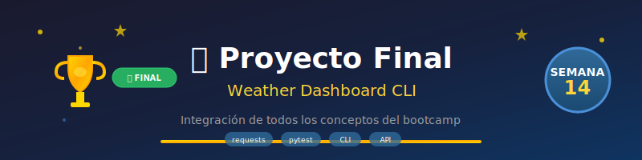

# 🎓 Semana 14: Proyecto Final Integrador



## 🎯 Objetivos de Aprendizaje

Al finalizar esta semana, serás capaz de:

- ✅ Integrar todos los conceptos aprendidos en un proyecto completo
- ✅ Diseñar y estructurar una aplicación Python desde cero
- ✅ Implementar arquitectura modular y mantenible
- ✅ Aplicar testing, logging y manejo de errores profesional
- ✅ Consumir APIs externas con la librería requests
- ✅ Documentar código siguiendo estándares de la industria
- ✅ Presentar y defender un proyecto técnico

---

## 📚 Requisitos Previos

- ✅ Semanas 1-13 completadas
- ✅ Dominio de POO, módulos y paquetes
- ✅ Experiencia con testing (pytest)
- ✅ Conocimiento de manejo de archivos y excepciones
- ✅ Familiaridad con decoradores y generadores

---

## 🗂️ Estructura de la Semana

```
week-14/
├── README.md                    # Este archivo
├── rubrica-evaluacion.md        # Criterios de evaluación (150 puntos)
├── 0-assets/                    # Recursos visuales
│   ├── week-14-header.svg
│   ├── 01-project-architecture.svg
│   ├── 02-api-flow.svg
│   └── 03-final-checklist.svg
├── 1-teoria/                    # Guías y mejores prácticas
│   ├── 01-arquitectura-proyecto.md
│   ├── 02-consumo-apis.md
│   ├── 03-documentacion-profesional.md
│   └── 04-presentacion-proyecto.md
├── 3-proyecto/                  # Proyecto Final
│   ├── README.md                # Especificación completa
│   ├── starter/                 # Código inicial
│   └── solution/                # Solución (oculta)
├── 4-recursos/                  # Material adicional
│   ├── ebooks.md
│   ├── videografia.md
│   └── webgrafia.md
└── 5-glosario/                  # Términos clave
    └── README.md
```

---

## 📝 Contenidos

### 1. Teoría y Guías (1.5 horas)

| Archivo | Tema | Duración |
|---------|------|----------|
| [01-arquitectura-proyecto.md](1-teoria/01-arquitectura-proyecto.md) | Diseño y estructura de proyectos | 25 min |
| [02-consumo-apis.md](1-teoria/02-consumo-apis.md) | Requests y APIs REST | 25 min |
| [03-documentacion-profesional.md](1-teoria/03-documentacion-profesional.md) | Docstrings, README, typing | 20 min |
| [04-presentacion-proyecto.md](1-teoria/04-presentacion-proyecto.md) | Cómo presentar tu proyecto | 20 min |

### 2. Proyecto Final (4.5 horas)

| Componente | Descripción | Tiempo |
|------------|-------------|--------|
| Diseño | Planificación y arquitectura | 30 min |
| Implementación | Desarrollo del código | 2.5 h |
| Testing | Suite de tests completa | 45 min |
| Documentación | README, docstrings | 30 min |
| Presentación | Preparación demo | 15 min |

---

## 🚀 El Proyecto: Weather Dashboard CLI

### Descripción

Desarrollarás una **aplicación de línea de comandos** que consume la API de OpenWeatherMap para mostrar información meteorológica, con las siguientes características:

- 🌡️ Consulta del clima actual por ciudad
- 📊 Pronóstico de 5 días
- ⭐ Sistema de ciudades favoritas (persistencia en JSON)
- 📈 Historial de consultas con estadísticas
- 🎨 Interfaz CLI con colores y formato profesional
- ✅ Suite de tests con >85% de cobertura

### Tecnologías

- **Python 3.13+** con type hints
- **requests** para consumo de API
- **pytest** + **pytest-cov** para testing
- **logging** para diagnóstico
- **JSON** para persistencia
- **argparse** o **click** para CLI

### Estructura del Proyecto

```
weather-dashboard/
├── src/
│   ├── __init__.py
│   ├── main.py              # Punto de entrada CLI
│   ├── api/
│   │   ├── __init__.py
│   │   └── weather_client.py
│   ├── models/
│   │   ├── __init__.py
│   │   ├── weather.py
│   │   └── forecast.py
│   ├── services/
│   │   ├── __init__.py
│   │   ├── favorites.py
│   │   └── history.py
│   └── utils/
│       ├── __init__.py
│       ├── display.py
│       └── config.py
├── tests/
│   ├── __init__.py
│   ├── conftest.py
│   ├── test_weather_client.py
│   ├── test_favorites.py
│   └── test_history.py
├── data/
│   ├── favorites.json
│   └── history.json
├── pyproject.toml
├── README.md
└── .env.example
```

---

## ⏱️ Distribución del Tiempo (6 horas)

| Actividad | Tiempo | Descripción |
|-----------|--------|-------------|
| Teoría | 1.5 h | Lectura de guías y preparación |
| Diseño | 0.5 h | Planificación de arquitectura |
| Implementación | 2.5 h | Desarrollo del código |
| Testing | 0.75 h | Escritura de tests |
| Documentación | 0.5 h | README y docstrings |
| Presentación | 0.25 h | Preparación de demo |

---

## 📌 Entregables

### Obligatorios

1. **Código fuente** completo y funcional
2. **Tests** con cobertura >85%
3. **README.md** profesional con:
   - Descripción del proyecto
   - Instrucciones de instalación
   - Guía de uso con ejemplos
   - Screenshots/GIFs de demostración
4. **Documentación** del código (docstrings)

### Opcionales (Puntos Extra)

- 🌟 Cache de respuestas API
- 🌟 Exportación a CSV/PDF
- 🌟 Gráficos ASCII del pronóstico
- 🌟 Soporte multi-idioma
- 🌟 Integración con Docker

---

## 🏆 Criterios de Éxito

| Criterio | Peso |
|----------|------|
| Funcionalidad completa | 30% |
| Calidad del código | 25% |
| Testing y cobertura | 20% |
| Documentación | 15% |
| Presentación | 10% |

**Nota mínima para aprobar: 70%**

---

## 🔗 Navegación

| ⬅️ Anterior | 🏠 Inicio | ➡️ Siguiente |
|:------------|:---------:|-------------:|
| [Semana 13: Testing](../week-13/README.md) | [Bootcamp](../../README.md) | 🎉 ¡Completado! |

---

## 💡 Consejos para el Éxito

1. **Planifica antes de codear**: Dibuja la arquitectura primero
2. **Commits frecuentes**: Guarda tu progreso regularmente
3. **Tests mientras desarrollas**: No dejes el testing para el final
4. **Documenta sobre la marcha**: Es más fácil que al final
5. **Pide ayuda**: No te quedes atascado, consulta recursos
6. **Disfruta el proceso**: ¡Es tu proyecto culminante!

---

## 🎊 ¡Felicitaciones!

Al completar esta semana, habrás terminado el **Bootcamp Python Zero to Hero**.

Tendrás:
- ✅ Un proyecto completo para tu portafolio
- ✅ Habilidades de desarrollador Python Junior
- ✅ Experiencia con herramientas profesionales
- ✅ Base sólida para seguir aprendiendo

**¡El viaje apenas comienza!** 🚀🐍

---

*Semana 14 de 14 | Proyecto Final Integrador | ~6 horas*
