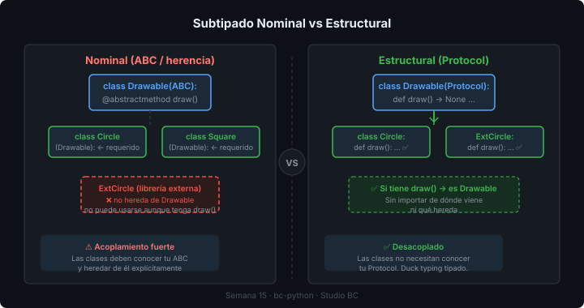

# 🔬 Type System Avanzado: Protocol, TypeGuard, TypeAlias, ParamSpec

## 🎯 Objetivos

- Entender qué es el subtipado estructural y cómo `Protocol` lo implementa
- Usar `TypeAlias` y el keyword `type` para nombres de tipo reutilizables
- Aplicar `TypeGuard` para narrowing explícito
- Usar `ParamSpec` para decoradores que preservan la firma de la función

---

## 1. Protocol — Contratos sin herencia

### El problema con ABC

Con `ABC`, las clases deben declarar explícitamente que implementan la interfaz:

```python
from abc import ABC, abstractmethod

class Drawable(ABC):
    @abstractmethod
    def draw(self) -> None: ...

class Circle(Drawable):      # debe heredar de Drawable
    def draw(self) -> None:
        print("drawing circle")
```

Si `Circle` viene de una librería externa que no conoce tu `Drawable`, no puedes hacer que la implemente.

### Protocol: subtipado estructural

`Protocol` define una interfaz por *forma*, no por linaje. Si un objeto tiene los métodos requeridos, cumple el protocolo — sin importar de dónde viene.

```python
from typing import Protocol

class Drawable(Protocol):
    def draw(self) -> None: ...

class Circle:          # sin herencia
    def draw(self) -> None:
        print("drawing circle")

class Square:          # también sin herencia
    def draw(self) -> None:
        print("drawing square")

def render(shape: Drawable) -> None:
    shape.draw()

render(Circle())   # ✅ OK
render(Square())   # ✅ OK
```



### Protocol en Studio BC

```python
from typing import Protocol
from datetime import datetime

class Nameable(Protocol):
    @property
    def name(self) -> str: ...

class Timestamped(Protocol):
    @property
    def created_at(self) -> datetime: ...

class Describable(Protocol):
    @property
    def description(self) -> str: ...

# Función que acepta cualquier objeto con name + created_at
def display_info(item: Nameable & Timestamped) -> None:
    print(f"{item.name} — creado: {item.created_at:%Y-%m-%d}")
```

### @runtime_checkable

Por defecto, `Protocol` solo funciona en tiempo de análisis (mypy). Para usar `isinstance()` en runtime:

```python
from typing import Protocol, runtime_checkable

@runtime_checkable
class Nameable(Protocol):
    @property
    def name(self) -> str: ...

class Client:
    def __init__(self, name: str) -> None:
        self._name = name

    @property
    def name(self) -> str:
        return self._name

print(isinstance(Client("Acme"), Nameable))   # True en runtime
```

> ⚠️ `@runtime_checkable` solo verifica la *existencia* de los atributos, no sus tipos.

---

## 2. TypeAlias — Nombres para tipos complejos

### Problema: tipos repetidos y difíciles de leer

```python
# ❌ difícil de leer cuando se repite
def get_projects(filters: dict[str, list[str | int]]) -> list[dict[str, str | int]]:
    ...
```

### TypeAlias (Python 3.10+)

```python
from typing import TypeAlias

ProjectFilter: TypeAlias = dict[str, list[str | int]]
ProjectRecord: TypeAlias = dict[str, str | int]

def get_projects(filters: ProjectFilter) -> list[ProjectRecord]:
    ...
```

### keyword `type` (Python 3.12+)

Python 3.12 introduce el keyword `type` que reemplaza a `TypeAlias`:

```python
# Python 3.12+
type ProjectFilter = dict[str, list[str | int]]
type ProjectRecord = dict[str, str | int]
type AssetId = int
type ClientId = int

# También funciona con genéricos
type Matrix[T] = list[list[T]]
```

> El keyword `type` es preferido en código nuevo con Python 3.12+. Usa `TypeAlias` si necesitas compatibilidad con 3.10/3.11.

---

## 3. TypeGuard — Narrowing explícito

### El problema

```python
from typing import Union

Asset = Union["VideoAsset", "ImageAsset", "AudioAsset"]

def process(asset: Asset) -> None:
    if isinstance(asset, VideoAsset):
        # mypy sabe que aquí es VideoAsset ✅
        asset.transcode()
```

`isinstance` funciona bien para clases concretas. Pero a veces la condición es más compleja:

```python
def process_assets(items: list[object]) -> None:
    for item in items:
        # mypy no sabe que item es Asset aquí ❌
        if is_valid_asset(item):
            item.name  # error: object has no attribute 'name'
```

### TypeGuard

```python
from typing import TypeGuard

def is_valid_asset(obj: object) -> TypeGuard["Asset"]:
    return (
        hasattr(obj, "name")
        and hasattr(obj, "file_path")
        and hasattr(obj, "asset_type")
    )

def process_assets(items: list[object]) -> None:
    for item in items:
        if is_valid_asset(item):
            print(item.name)      # ✅ mypy sabe que es Asset
            print(item.file_path) # ✅
```

La función `TypeGuard[T]` le dice a mypy: *"si esta función retorna True, el argumento es de tipo T en el bloque if"*.

### TypeIs (Python 3.13)

Python 3.13 introduce `TypeIs`, una versión más precisa de `TypeGuard`:

```python
from typing import TypeIs   # Python 3.13+

def is_str(val: str | int) -> TypeIs[str]:
    return isinstance(val, str)

def process(val: str | int) -> None:
    if is_str(val):
        print(val.upper())   # ✅ val es str
    else:
        print(val + 1)       # ✅ val es int (TypeIs hace narrowing en else también)
```

> `TypeGuard` no hace narrowing en el `else`. `TypeIs` sí. Usa `TypeIs` cuando la función realmente garantiza el tipo exacto.

---

## 4. ParamSpec — Decoradores que preservan la firma

### El problema

```python
from typing import Callable, TypeVar

F = TypeVar("F", bound=Callable[..., object])

def log_call(func: F) -> F:
    def wrapper(*args, **kwargs):   # los tipos se pierden
        print(f"calling {func.__name__}")
        return func(*args, **kwargs)
    return wrapper  # type: ignore — mypy no puede verificar esto bien
```

### ParamSpec

```python
from typing import ParamSpec, TypeVar, Callable
from functools import wraps

P = ParamSpec("P")
R = TypeVar("R")

def log_call(func: Callable[P, R]) -> Callable[P, R]:
    @wraps(func)
    def wrapper(*args: P.args, **kwargs: P.kwargs) -> R:
        print(f"calling {func.__name__}")
        return func(*args, **kwargs)
    return wrapper

@log_call
def create_project(name: str, client_id: int, budget: float) -> dict[str, object]:
    return {"name": name, "client_id": client_id, "budget": budget}

# mypy sabe exactamente los tipos de create_project ✅
result = create_project("Campaña 2026", 42, 15000.0)
# create_project("Campaña", "no-es-int")  ← mypy error ✅
```

`P.args` y `P.kwargs` capturan los parámetros posicionales y keyword del original, preservando toda la información de tipos.

---

## ✅ Resumen

| Feature | Versión | Para qué |
|---------|---------|---------|
| `Protocol` | 3.8+ | Contratos estructurales sin herencia |
| `@runtime_checkable` | 3.8+ | `isinstance()` con Protocols |
| `TypeAlias` | 3.10+ | Alias de tipos complejos (legibilidad) |
| `type` keyword | 3.12+ | Alias de tipos (sintaxis moderna) |
| `TypeGuard` | 3.10+ | Narrowing en funciones de validación |
| `TypeIs` | 3.13+ | Narrowing bidiferencial (if + else) |
| `ParamSpec` | 3.10+ | Decoradores que preservan firma |

---

## 📚 Recursos Adicionales

- [PEP 544 — Protocols](https://peps.python.org/pep-0544/)
- [PEP 647 — TypeGuard](https://peps.python.org/pep-0647/)
- [PEP 612 — ParamSpec](https://peps.python.org/pep-0612/)
- [mypy — Protocols](https://mypy.readthedocs.io/en/stable/protocols.html)
