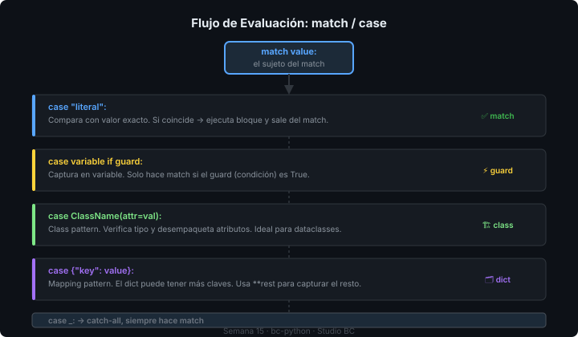

# 🎯 Structural Pattern Matching Completo

## 🎯 Objetivos

- Dominar todos los tipos de patrones disponibles en `match/case`
- Usar guards para condiciones adicionales
- Aplicar class patterns y mapping patterns en casos reales
- Saber cuándo `match` es mejor que `if/elif`

---

## 1. Repaso: lo básico

```python
command = "start"

match command:
    case "start":
        print("iniciando...")
    case "stop":
        print("deteniendo...")
    case _:
        print("comando desconocido")
```

`_` es el wildcard — captura cualquier valor sin asignarlo a una variable.

---

## 2. Capture patterns — capturar el valor

```python
match command:
    case "start":
        print("inicio fijo")
    case other:          # captura el valor en 'other'
        print(f"comando desconocido: {other}")
```

> ⚠️ Diferencia clave: `"start"` es una comparación de valor. `other` (sin comillas) es una *captura* — siempre hace match y asigna el valor.

Para comparar con una variable existente, usa un punto o `|`:

```python
VALID_COMMANDS = {"start", "stop", "pause"}

# ❌ Esto NO compara con la variable, captura en 'valid_commands'
match command:
    case valid_commands:   # siempre hace match — bug silencioso
        ...

# ✅ Usa un guard en su lugar
match command:
    case cmd if cmd in VALID_COMMANDS:
        print(f"comando válido: {cmd}")
    case _:
        print("inválido")
```

---

## 3. Guards — condiciones adicionales

```python
def route_asset(asset_type: str, file_size_mb: float) -> str:
    match asset_type:
        case "video" if file_size_mb > 1000:
            return "upload to cold storage"
        case "video" if file_size_mb > 100:
            return "upload to warm storage"
        case "video":
            return "upload to hot storage"
        case "image" if file_size_mb > 50:
            return "compress before upload"
        case "image":
            return "upload directly"
        case _:
            return "unknown asset type"
```



---

## 4. Sequence patterns — listas y tuplas

```python
def parse_command(args: list[str]) -> str:
    match args:
        case []:
            return "no arguments"
        case [cmd]:
            return f"single command: {cmd}"
        case [cmd, target]:
            return f"command {cmd} on {target}"
        case [cmd, *rest]:            # *rest captura el resto
            return f"command {cmd} with {len(rest)} extra args"
```

```python
# Con tipos específicos
match point:
    case (0, 0):
        print("origin")
    case (x, 0):
        print(f"on x-axis at {x}")
    case (0, y):
        print(f"on y-axis at {y}")
    case (x, y):
        print(f"point at ({x}, {y})")
```

---

## 5. Mapping patterns — diccionarios

```python
def handle_event(event: dict[str, object]) -> None:
    match event:
        case {"type": "project_created", "name": name, "client_id": int(cid)}:
            print(f"nuevo proyecto: {name}, cliente #{cid}")

        case {"type": "asset_uploaded", "file": str(path), **rest}:
            # **rest captura las claves restantes
            print(f"asset subido: {path}, metadata: {rest}")

        case {"type": "error", "code": code, "message": msg}:
            print(f"error {code}: {msg}")

        case {"type": unknown_type}:
            print(f"evento desconocido: {unknown_type}")
```

> Los mapping patterns son parciales por defecto: el diccionario puede tener más claves de las que el patrón especifica.

---

## 6. Class patterns — objetos

```python
from dataclasses import dataclass

@dataclass
class VideoAsset:
    name: str
    duration_seconds: float
    codec: str

@dataclass
class ImageAsset:
    name: str
    width: int
    height: int

@dataclass
class AudioAsset:
    name: str
    duration_seconds: float
    bitrate_kbps: int

type Asset = VideoAsset | ImageAsset | AudioAsset

def describe_asset(asset: Asset) -> str:
    match asset:
        case VideoAsset(name=n, duration_seconds=d) if d > 3600:
            return f"video largo: {n} ({d/3600:.1f}h)"
        case VideoAsset(name=n, codec="h265"):
            return f"video HEVC: {n}"
        case VideoAsset(name=n):
            return f"video: {n}"
        case ImageAsset(name=n, width=w, height=h):
            return f"imagen: {n} ({w}x{h}px)"
        case AudioAsset(name=n, bitrate_kbps=b) if b >= 320:
            return f"audio lossless: {n}"
        case AudioAsset(name=n):
            return f"audio: {n}"
```

---

## 7. OR patterns — múltiples valores

```python
def is_media(asset_type: str) -> bool:
    match asset_type:
        case "video" | "audio" | "image":
            return True
        case _:
            return False
```

```python
match status:
    case "pending" | "queued":
        print("en cola")
    case "processing" | "uploading":
        print("en progreso")
    case "done" | "published":
        print("completado")
    case "failed" | "cancelled":
        print("terminado con error")
```

---

## 8. match vs if/elif — cuándo usar cada uno

| Situación | Usar |
|-----------|------|
| Comparar con constantes simples | `match` |
| Desempaquetar estructuras (dict, list, dataclass) | `match` |
| Múltiples condiciones booleanas complejas | `if/elif` |
| Condiciones sobre rangos numéricos continuos | `if/elif` |
| Una sola condición | `if` |

```python
# ✅ match: desempaquetar y clasificar
match response:
    case {"status": 200, "data": data}:
        process(data)
    case {"status": 404}:
        handle_not_found()
    case {"status": int(code)} if 500 <= code < 600:
        handle_server_error(code)

# ✅ if/elif: rangos y condiciones booleanas
if budget > 100_000 and deadline < 30:
    apply_rush_fee()
elif budget > 50_000:
    apply_standard_rate()
else:
    apply_basic_rate()
```

---

## ✅ Resumen de patrones

| Patrón | Sintaxis | Ejemplo |
|--------|----------|---------|
| Literal | `case "valor":` | `case "start":` |
| Wildcard | `case _:` | catch-all |
| Captura | `case x:` | asigna a variable |
| Guard | `case x if condición:` | `case n if n > 0:` |
| OR | `case a \| b:` | `case "a" \| "b":` |
| Sequence | `case [a, b]:` | `case [cmd, *args]:` |
| Mapping | `case {"k": v}:` | `case {"type": t}:` |
| Class | `case ClassName(attr=v):` | `case Video(name=n):` |

---

## 📚 Recursos Adicionales

- [PEP 634 — Structural Pattern Matching](https://peps.python.org/pep-0634/)
- [PEP 636 — Tutorial de Pattern Matching](https://peps.python.org/pep-0636/)
