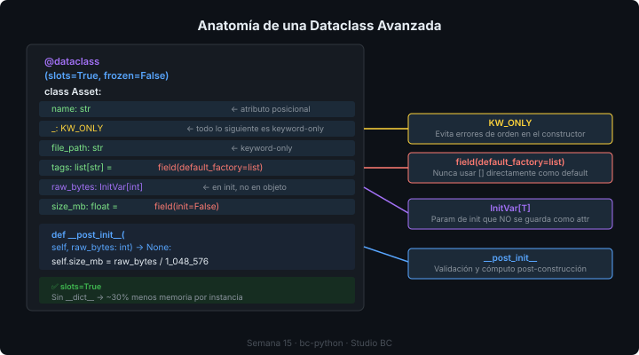

# 🏗️ Dataclasses Avanzadas

## 🎯 Objetivos

- Controlar la inicialización con `__post_init__` e `InitVar`
- Reducir el uso de memoria con `__slots__`
- Usar `field()` para defaults, factories y metadatos
- Aplicar `KW_ONLY` para forzar argumentos keyword-only
- Combinar `frozen=True` para objetos inmutables

---

## 1. Repaso: dataclass básica

```python
from dataclasses import dataclass

@dataclass
class Client:
    name: str
    email: str
    active: bool = True
```

Esto genera automáticamente `__init__`, `__repr__` y `__eq__`. El problema es que para casos más complejos necesitamos más control.

---

## 2. `field()` — control fino de atributos

```python
from dataclasses import dataclass, field
from datetime import datetime

@dataclass
class Project:
    name: str
    client_id: int
    tags: list[str] = field(default_factory=list)      # ✅ mutable default
    metadata: dict[str, str] = field(default_factory=dict)
    created_at: datetime = field(default_factory=datetime.now)
    _internal_id: str = field(default="", repr=False, compare=False)
```

> ❌ **Nunca** uses `tags: list[str] = []` en una dataclass — ese objeto se comparte entre instancias.
> ✅ Siempre usa `field(default_factory=list)` para colecciones.

### Parámetros de `field()`

| Parámetro | Tipo | Descripción |
|-----------|------|-------------|
| `default` | any | Valor por defecto escalar |
| `default_factory` | callable | Función que genera el default |
| `repr` | bool | Incluir en `__repr__` (default: True) |
| `compare` | bool | Incluir en `__eq__` y `__hash__` |
| `hash` | bool | Incluir en `__hash__` |
| `init` | bool | Incluir como parámetro de `__init__` |
| `metadata` | mapping | Info adicional para librerías |

---

## 3. `__post_init__` — validación y cómputo

Se ejecuta automáticamente al final de `__init__`:

```python
from dataclasses import dataclass, field
from datetime import date

@dataclass
class Project:
    name: str
    start_date: date
    end_date: date
    budget: float
    slug: str = field(init=False)    # calculado, no recibe valor

    def __post_init__(self) -> None:
        # validación
        if self.end_date <= self.start_date:
            raise ValueError(
                f"end_date ({self.end_date}) must be after start_date ({self.start_date})"
            )
        if self.budget <= 0:
            raise ValueError(f"budget must be positive, got {self.budget}")

        # cómputo derivado
        self.slug = self.name.lower().replace(" ", "-")
```

```python
# Uso
p = Project(
    name="Campaña Navidad",
    start_date=date(2026, 11, 1),
    end_date=date(2026, 12, 31),
    budget=50_000.0
)
print(p.slug)   # "campaña-navidad"

# Esto lanza ValueError
Project(
    name="Error",
    start_date=date(2026, 12, 1),
    end_date=date(2026, 11, 1),   # antes del inicio
    budget=1000.0
)
```

### `InitVar` — parámetros de init que no son atributos

```python
from dataclasses import dataclass, InitVar, field

@dataclass
class Asset:
    name: str
    file_path: str
    raw_size_bytes: InitVar[int]      # recibe en __init__ pero NO se almacena
    size_mb: float = field(init=False)

    def __post_init__(self, raw_size_bytes: int) -> None:
        self.size_mb = raw_size_bytes / (1024 * 1024)

a = Asset(name="video.mp4", file_path="/media/video.mp4", raw_size_bytes=104_857_600)
print(a.size_mb)          # 100.0
print(a.raw_size_bytes)   # AttributeError — no existe como atributo ✅
```

---

## 4. `__slots__` — menos memoria, más velocidad

Por defecto, los objetos Python usan un `__dict__` para almacenar sus atributos. `__slots__` reemplaza ese dict por un array fijo, reduciendo el uso de memoria significativamente.



```python
from dataclasses import dataclass

@dataclass(slots=True)   # Python 3.10+ — manera moderna
class Asset:
    name: str
    file_path: str
    size_mb: float
    asset_type: str
```

```python
import sys

@dataclass
class AssetNormal:
    name: str
    file_path: str

@dataclass(slots=True)
class AssetSlots:
    name: str
    file_path: str

normal = AssetNormal("video.mp4", "/media/video.mp4")
slotted = AssetSlots("video.mp4", "/media/video.mp4")

print(sys.getsizeof(normal.__dict__))  # ~232 bytes (el __dict__)
# slotted no tiene __dict__ — usa ~48 bytes menos por instancia
```

> Cuando manejas miles de objetos (assets de un pipeline), `slots=True` puede reducir el uso de memoria en un 30–50%.

### Limitaciones de `__slots__`

- No puedes agregar atributos dinámicamente después de la creación
- La herencia con `__slots__` requiere cuidado (cada clase en la jerarquía define sus propios slots)

---

## 5. `KW_ONLY` — argumentos keyword-obligatorios

```python
from dataclasses import dataclass, field, KW_ONLY

@dataclass
class Deliverable:
    name: str                          # posicional
    _: KW_ONLY                         # todo lo que sigue es keyword-only
    project_id: int
    phase: str
    due_date: date
    approved: bool = False

# ✅ correcto
d = Deliverable("Video Final", project_id=42, phase="post", due_date=date(2026, 12, 1))

# ❌ error — project_id no puede ser posicional
d = Deliverable("Video Final", 42, "post", date(2026, 12, 1))
```

`KW_ONLY` es útil cuando tienes muchos parámetros opcionales y quieres evitar el orden incorrecto al llamar al constructor.

---

## 6. `frozen=True` — inmutabilidad

```python
from dataclasses import dataclass

@dataclass(frozen=True)
class AssetType:
    name: str
    extension: str
    mime_type: str

VIDEO_MP4 = AssetType("MP4 Video", ".mp4", "video/mp4")
IMAGE_PNG = AssetType("PNG Image", ".png", "image/png")

VIDEO_MP4.name = "other"   # FrozenInstanceError ✅
```

`frozen=True` también hace que la dataclass sea hashable:

```python
asset_types: set[AssetType] = {VIDEO_MP4, IMAGE_PNG}
type_map: dict[AssetType, str] = {VIDEO_MP4: "video pipeline"}
```

### `frozen` + `slots` — combinación óptima para objetos de valor

```python
@dataclass(frozen=True, slots=True)
class Money:
    amount: float
    currency: str = "USD"

    def __add__(self, other: "Money") -> "Money":
        if self.currency != other.currency:
            raise ValueError("cannot add different currencies")
        return Money(self.amount + other.amount, self.currency)
```

---

## 7. Combinando todo

```python
from dataclasses import dataclass, field, KW_ONLY
from datetime import date, datetime
from typing import Protocol

class Timestamped(Protocol):
    @property
    def created_at(self) -> datetime: ...

@dataclass(slots=True)
class Client:
    name: str
    email: str
    _: KW_ONLY
    phone: str = ""
    active: bool = True
    created_at: datetime = field(default_factory=datetime.now, compare=False)

    def __post_init__(self) -> None:
        if "@" not in self.email:
            raise ValueError(f"invalid email: {self.email}")

@dataclass(slots=True)
class Project:
    name: str
    client_id: int
    _: KW_ONLY
    start_date: date
    end_date: date
    budget: float
    tags: list[str] = field(default_factory=list)
    created_at: datetime = field(default_factory=datetime.now, compare=False)

    def __post_init__(self) -> None:
        if self.end_date <= self.start_date:
            raise ValueError("end_date must be after start_date")
```

---

## ✅ Resumen

| Feature | Parámetro / Syntax | Para qué |
|---------|-------------------|---------|
| Default mutable | `field(default_factory=list)` | Listas/dicts como defaults |
| Validación | `__post_init__` | Validar y calcular atributos |
| Parámetro sin atributo | `InitVar[T]` | Recibir info en init sin guardarla |
| Memoria eficiente | `@dataclass(slots=True)` | Miles de instancias |
| Keyword-only | `_: KW_ONLY` | Evitar errores de orden |
| Inmutabilidad | `@dataclass(frozen=True)` | Value objects hashables |

---

## 📚 Recursos Adicionales

- [Python docs — dataclasses](https://docs.python.org/3/library/dataclasses.html)
- [PEP 557 — Data Classes](https://peps.python.org/pep-0557/)
- [PEP 681 — dataclass_transform](https://peps.python.org/pep-0681/)
