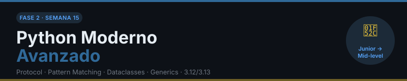

# 🔬 Semana 15: Python Moderno Avanzado

> **Fase 2 — Python Profesional** · _Junior → Mid-level_

<p align="center">
  
</p>

---

## 🎯 Objetivos de Aprendizaje

Al finalizar esta semana, serás capaz de:

- ✅ Usar `Protocol` para definir contratos de tipo sin herencia explícita
- ✅ Aplicar `TypeGuard`, `TypeAlias` y `ParamSpec` en código real
- ✅ Dominar Structural Pattern Matching con guards, class patterns y mapping patterns
- ✅ Construir dataclasses avanzadas con `__slots__`, `__post_init__`, `KW_ONLY` y `field()`
- ✅ Usar Generics nativos y el tipo `Self` para APIs fluentes
- ✅ Aplicar las novedades de Python 3.12/3.13: keyword `type`, f-strings mejoradas, `@override`

---

## 📚 Requisitos Previos

- ✅ Semanas 1–14 completadas
- ✅ Dominio de type hints básicos (`int`, `str`, `list[T]`, `dict[K, V]`, `Optional`)
- ✅ Experiencia con clases, herencia y ABCs
- ✅ Familiaridad con decoradores

---

## 🗂️ Estructura de la Semana

```
week-15-python_moderno_avanzado/
├── README.md                        # Este archivo
├── rubrica-evaluacion.md            # Criterios de evaluación
├── 0-assets/
│   ├── week-15-header.svg
│   ├── 01-protocol-vs-nominal.svg   # Subtipado estructural vs nominal
│   ├── 02-pattern-matching-flujo.svg
│   └── 03-dataclass-anatomia.svg
├── 1-teoria/
│   ├── 01-type-system-avanzado.md   # Protocol, TypeGuard, TypeAlias, ParamSpec
│   ├── 02-pattern-matching.md       # match/case completo
│   ├── 03-dataclasses-avanzadas.md  # __slots__, __post_init__, KW_ONLY
│   ├── 04-generics-y-self.md        # Generics nativos, Self type
│   └── 05-python-312-313.md         # Novedades 3.12/3.13
├── 2-ejercicios/
│   ├── 01-ejercicio-protocols/
│   ├── 02-ejercicio-pattern-matching/
│   ├── 03-ejercicio-dataclasses/
│   └── 04-ejercicio-typeguard/
├── 3-proyecto/
│   ├── README.md                    # Modelado de entidades Studio BC
│   ├── starter/
│   └── solution/                    # ⚠️ Solo instructores
├── 4-recursos/
│   ├── ebooks-free/README.md
│   ├── videografia/README.md
│   └── webgrafia/README.md
└── 5-glosario/README.md
```

---

## 📝 Contenidos

### 📚 Teoría

| # | Archivo | Tema | Diagrama |
|---|---------|------|----------|
| 1 | [01-type-system-avanzado.md](1-teoria/01-type-system-avanzado.md) | Protocol, TypeGuard, TypeAlias, ParamSpec | `01-protocol-vs-nominal.svg` |
| 2 | [02-pattern-matching.md](1-teoria/02-pattern-matching.md) | match/case completo con guards y class patterns | `02-pattern-matching-flujo.svg` |
| 3 | [03-dataclasses-avanzadas.md](1-teoria/03-dataclasses-avanzadas.md) | __slots__, __post_init__, KW_ONLY, field() | `03-dataclass-anatomia.svg` |
| 4 | [04-generics-y-self.md](1-teoria/04-generics-y-self.md) | TypeVar, Generic, Self, covariance | — |
| 5 | [05-python-312-313.md](1-teoria/05-python-312-313.md) | keyword `type`, f-strings 3.12, @override | — |

### 💻 Ejercicios Guiados

| # | Ejercicio | Concepto principal |
|---|-----------|-------------------|
| 1 | [01-ejercicio-protocols](2-ejercicios/01-ejercicio-protocols/) | Definir y usar `Protocol` en entidades del estudio |
| 2 | [02-ejercicio-pattern-matching](2-ejercicios/02-ejercicio-pattern-matching/) | Routing de comandos CLI con `match/case` |
| 3 | [03-ejercicio-dataclasses](2-ejercicios/03-ejercicio-dataclasses/) | Modelar `Client` y `Asset` con dataclasses avanzadas |
| 4 | [04-ejercicio-typeguard](2-ejercicios/04-ejercicio-typeguard/) | Type narrowing con `TypeGuard` |

### 🎯 Proyecto Semanal

[**Modelado de Entidades Studio BC**](3-proyecto/README.md) — Construir el modelo de dominio completo del estudio audiovisual usando Protocols, dataclasses y tipos estrictos.

---

## ⏱️ Distribución del Tiempo (6h)

| Bloque | Actividad | Tiempo estimado |
|--------|-----------|-----------------|
| 1 | Teoría: archivos 01–03 (type system, match, dataclasses) | 2h |
| 2 | Ejercicios guiados 01–04 | 2h |
| 3 | Teoría: archivos 04–05 (generics, 3.12/3.13) | 30min |
| 4 | Proyecto semanal | 1.5h |

---

## 📌 Entregables

- [ ] Ejercicios 01–04 ejecutando sin errores
- [ ] Proyecto: archivo `src/models.py` con todas las entidades tipadas
- [ ] Sin errores de mypy en modo strict (`mypy --strict`)

---

## 🔗 Navegación

← [Semana 14 — Proyecto Final Integrador](../week-14-proyecto_final_integrador/README.md) · [Semana 16 — Concurrencia y AsyncIO](../week-16-concurrencia_y_asyncio/README.md) →
