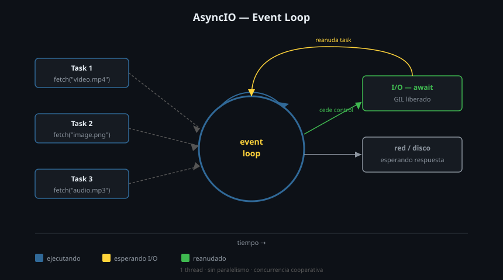

# ⚡ AsyncIO: Fundamentos

## 🎯 Objetivos

- Entender qué es el event loop y cómo logra concurrencia sin threads
- Escribir corutinas con `async def` y ceder control con `await`
- Crear y gestionar Tasks con `asyncio.create_task()`
- Comprender la diferencia entre corutina, Task y Future

---

## 1. El problema: código bloqueante

```python
import time
import requests  # biblioteca síncrona

def download_asset(url: str) -> bytes:
    response = requests.get(url)   # bloquea el hilo completo
    return response.content

# Descargar 5 assets secuencialmente: 5 × 2s = 10s
for url in asset_urls:
    data = download_asset(url)     # el programa no hace NADA mientras espera
```

Mientras `requests.get` espera la respuesta del servidor, la CPU está ociosa. No hace nada más.

---

## 2. El event loop: concurrencia cooperativa

asyncio usa un único thread con un **event loop** — un bucle que gestiona múltiples tareas pendientes. Cuando una tarea debe *esperar* (red, disco), cede el control al loop, que avanza con otra tarea.



**Clave**: asyncio no crea threads. Es concurrente pero no paralelo. Funciona porque la mayoría del tiempo de I/O es *espera*, no CPU.

---

## 3. Corutinas: `async def` y `await`

Una **corutina** es una función que puede pausarse y reanudarse:

```python
import asyncio

async def greet(name: str) -> str:          # async def define una corutina
    await asyncio.sleep(1)                  # pausa: cede al event loop
    return f"Hola, {name}!"

# Una corutina NO se ejecuta al llamarla — devuelve un objeto corutina
coro = greet("Studio BC")    # <coroutine object greet at 0x...>

# Para ejecutarla necesitas asyncio.run() o await
result = asyncio.run(greet("Studio BC"))    # ✅ ejecuta el event loop
print(result)   # "Hola, Studio BC!"
```

> `await` solo puede usarse dentro de una función `async def`. Es el punto donde la corutina puede ceder el control.

### `asyncio.run()` — punto de entrada

```python
import asyncio

async def main() -> None:
    print("inicio")
    await asyncio.sleep(0.5)
    print("fin")

asyncio.run(main())    # crea el event loop, ejecuta main(), lo cierra
```

`asyncio.run()` es el único punto de entrada desde código síncrono. Solo debe llamarse una vez.

---

## 4. Ejecución concurrente: dos corutinas en paralelo

Sin Tasks, las corutinas se ejecutan secuencialmente aunque sean async:

```python
async def main() -> None:
    await fetch_asset("video.mp4")    # espera que termine
    await fetch_asset("image.png")    # luego empieza esta
    # Total: suma de ambos tiempos
```

Con Tasks, el event loop las intercala:

```python
async def main() -> None:
    task1 = asyncio.create_task(fetch_asset("video.mp4"))
    task2 = asyncio.create_task(fetch_asset("image.png"))
    # Ambas tareas ya están programadas para ejecutarse

    result1 = await task1    # espera task1 pero task2 avanza mientras tanto
    result2 = await task2
    # Total: max(tiempo1, tiempo2)
```

---

## 5. Tasks: `asyncio.create_task()`

Un **Task** es una corutina envuelta para ejecutarse concurrentemente en el event loop:

```python
import asyncio
import time

async def simulate_download(name: str, delay: float) -> str:
    print(f"  starting {name}")
    await asyncio.sleep(delay)         # simula I/O sin bloquear
    print(f"  done {name}")
    return f"{name} downloaded"

async def main() -> None:
    start = time.perf_counter()

    # Crear tasks — se programan de inmediato
    task_video = asyncio.create_task(simulate_download("video.mp4", 2.0))
    task_image = asyncio.create_task(simulate_download("image.png", 1.0))
    task_audio = asyncio.create_task(simulate_download("audio.mp3", 1.5))

    # Await los tasks — el loop los intercala
    results = [
        await task_video,
        await task_image,
        await task_audio,
    ]

    elapsed = time.perf_counter() - start
    print(f"\nResultados: {results}")
    print(f"Tiempo: {elapsed:.2f}s")   # ~2.0s, no 4.5s

asyncio.run(main())
```

Salida:
```
  starting video.mp4
  starting image.png
  starting audio.mp3
  done image.png
  done audio.mp3
  done video.mp4

Resultados: ['video.mp4 downloaded', 'image.png downloaded', 'audio.mp3 downloaded']
Tiempo: 2.01s
```

---

## 6. Futures

Un **Future** es un objeto de bajo nivel que representa un resultado que *todavía no está disponible*. Los Tasks son un subtipo de Future.

En la práctica, raramente creas Futures directamente. Aparecen cuando integras asyncio con código externo (callbacks, `concurrent.futures`):

```python
import asyncio
from concurrent.futures import ThreadPoolExecutor

def blocking_function(n: int) -> int:
    """Función síncrona y bloqueante."""
    import time
    time.sleep(1)
    return n * 2

async def main() -> None:
    loop = asyncio.get_running_loop()

    with ThreadPoolExecutor() as pool:
        # run_in_executor devuelve un Future que asyncio puede awaitar
        future = loop.run_in_executor(pool, blocking_function, 21)
        result = await future
        print(result)   # 42

asyncio.run(main())
```

---

## 7. Context managers y iteradores async

```python
# async with — para recursos que requieren setup/teardown async
async with aiofiles.open("assets.txt") as f:
    content = await f.read()

# async for — para iterables que producen valores asincrónicamente
async for chunk in response.content.iter_chunked(1024):
    process(chunk)
```

---

## ✅ Resumen

| Concepto | Qué es | Cómo se crea |
|---------|--------|-------------|
| Corutina | Función pausable | `async def f(): ...` |
| Task | Corutina programada en el loop | `asyncio.create_task(coro)` |
| Future | Resultado futuro (bajo nivel) | `loop.run_in_executor(...)` |
| `await` | Cede control al loop | Dentro de `async def` |
| `asyncio.run()` | Punto de entrada | Una vez por programa |

---

## 📚 Recursos Adicionales

- [asyncio — Python docs](https://docs.python.org/3/library/asyncio.html)
- [PEP 492 — Coroutines with async/await](https://peps.python.org/pep-0492/)
