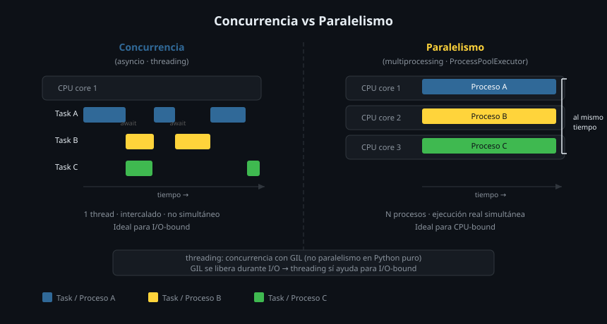

# 🔀 concurrent.futures: ThreadPoolExecutor y ProcessPoolExecutor

## 🎯 Objetivos

- Usar `ThreadPoolExecutor` para paralelizar tareas I/O-bound con código síncrono
- Usar `ProcessPoolExecutor` para paralelizar tareas CPU-bound en múltiples procesos
- Elegir entre `submit()` y `map()` según el caso
- Integrar executors con asyncio mediante `run_in_executor`

---

## 1. El módulo `concurrent.futures`

`concurrent.futures` proporciona una interfaz de alto nivel para ejecutar código en paralelo, compatible con tanto threads como procesos. Es la opción cuando tienes código **síncrono** que necesitas paralelizar.



```python
from concurrent.futures import ThreadPoolExecutor, ProcessPoolExecutor, as_completed
```

---

## 2. `ThreadPoolExecutor` — I/O bound síncrono

Ideal para código síncrono que pasa la mayoría del tiempo esperando I/O: descargas HTTP con `requests`, lectura de archivos, consultas a bases de datos.

```python
import time
from concurrent.futures import ThreadPoolExecutor

def download_asset(url: str) -> str:
    """Función síncrona y bloqueante."""
    time.sleep(1)    # simula red
    return f"downloaded: {url}"

urls = [f"https://cdn.studio.bc/asset_{i}.mp4" for i in range(8)]

# Con un solo thread: 8 × 1s = 8s
# Con 4 threads: ~2s (4 en paralelo, luego 4 más)
with ThreadPoolExecutor(max_workers=4) as executor:
    results = list(executor.map(download_asset, urls))

print(results)
```

### `submit()` — control individual

```python
from concurrent.futures import ThreadPoolExecutor, as_completed, Future

def resize_image(path: str, width: int) -> str:
    time.sleep(0.5)
    return f"resized {path} to {width}px"

paths = ["thumb_01.jpg", "thumb_02.jpg", "thumb_03.jpg"]

with ThreadPoolExecutor(max_workers=3) as executor:
    # submit() retorna un Future por cada tarea
    futures: list[Future[str]] = [
        executor.submit(resize_image, path, 800)
        for path in paths
    ]

    # Procesar en orden de finalización (no de creación)
    for future in as_completed(futures):
        try:
            result = future.result()
            print(f"ok: {result}")
        except Exception as e:
            print(f"error: {e}")
```

### `map()` vs `submit()`

| | `map()` | `submit()` |
|-|---------|-----------|
| Retorna | iterador de resultados (en orden) | `Future` por tarea |
| Errores | lanza en la primera excepción | `future.result()` controla cuándo |
| Orden | mismo que input | `as_completed` = orden de finalización |
| Uso | cuando no necesitas control individual | cuando necesitas más control |

---

## 3. `ProcessPoolExecutor` — CPU bound

Cuando el cuello de botella es la CPU (transcoding, compresión, análisis de frames), los threads no ayudan por el GIL. Necesitas **procesos reales**:

```python
import os
import time
from concurrent.futures import ProcessPoolExecutor

def transcode_segment(segment_path: str, codec: str) -> str:
    """CPU-bound: transcoding de video."""
    # Simula trabajo intensivo de CPU
    time.sleep(2)
    return f"transcoded {segment_path} to {codec}"

segments = [f"segment_{i:02d}.mp4" for i in range(4)]

# Cada worker es un proceso separado — verdadero paralelismo
with ProcessPoolExecutor(max_workers=os.cpu_count()) as executor:
    results = list(executor.map(transcode_segment, segments, ["h265"] * 4))

print(results)
```

> ⚠️ En Windows, el código que usa `ProcessPoolExecutor` **debe** estar dentro de `if __name__ == "__main__":` para evitar que los procesos hijos se lancen recursivamente.

### Restricciones de ProcessPoolExecutor

- Las funciones y argumentos deben ser **picklables** (serializables)
- No puedes usar lambdas ni funciones locales como worker
- La comunicación entre procesos tiene overhead — no usar para tareas muy pequeñas

```python
# ❌ No funciona — lambdas no son picklables
executor.submit(lambda x: x * 2, 5)

# ✅ Función a nivel de módulo
def double(x: int) -> int:
    return x * 2

executor.submit(double, 5)
```

---

## 4. `as_completed()` — procesar según van terminando

```python
from concurrent.futures import ThreadPoolExecutor, as_completed
import time

def check_asset(path: str) -> dict[str, object]:
    time.sleep(float(hash(path) % 3))    # delay variable
    return {"path": path, "valid": True, "size_mb": 100.0}

paths = ["video_01.mp4", "video_02.mp4", "image_01.png", "audio_01.mp3"]

with ThreadPoolExecutor(max_workers=4) as executor:
    future_to_path = {
        executor.submit(check_asset, p): p
        for p in paths
    }

    for future in as_completed(future_to_path):
        path = future_to_path[future]
        try:
            result = future.result()
            print(f"✅ {path}: {result}")
        except Exception as e:
            print(f"❌ {path}: {e}")
```

---

## 5. Integración con asyncio: `run_in_executor`

Desde una corutina, puedes delegar código bloqueante a un executor sin bloquear el event loop:

```python
import asyncio
from concurrent.futures import ThreadPoolExecutor, ProcessPoolExecutor
import time

def sync_io_task(name: str) -> str:
    """Código síncrono bloqueante (I/O)."""
    time.sleep(1)
    return f"{name} loaded"

def sync_cpu_task(data: bytes) -> bytes:
    """Código síncrono CPU-bound."""
    return data * 2    # simula compresión

async def main() -> None:
    loop = asyncio.get_running_loop()

    # I/O bound → ThreadPoolExecutor (None usa el default thread pool)
    result = await loop.run_in_executor(None, sync_io_task, "video.mp4")
    print(result)

    # CPU bound → ProcessPoolExecutor
    with ProcessPoolExecutor() as pool:
        compressed = await loop.run_in_executor(pool, sync_cpu_task, b"raw data")
    print(f"compressed: {len(compressed)} bytes")

asyncio.run(main())
```

> `run_in_executor(None, func, *args)` usa el pool de threads por defecto. Es la forma estándar de integrar bibliotecas síncronas (boto3, Pillow, ffmpeg-python) en código async.

---

## ✅ Resumen de cuándo usar cada executor

| Caso | Executor |
|------|---------|
| Requests HTTP síncronos (requests, boto3) | `ThreadPoolExecutor` |
| Lectura/escritura de archivos síncronos | `ThreadPoolExecutor` |
| Transcoding de video (FFmpeg, CPU intensivo) | `ProcessPoolExecutor` |
| Análisis de imágenes (Pillow en batch) | `ProcessPoolExecutor` |
| Código async nativo (httpx, aiofiles) | asyncio directo, sin executor |

---

## 📚 Recursos Adicionales

- [concurrent.futures — Python docs](https://docs.python.org/3/library/concurrent.futures.html)
- [PEP 3148 — futures — execute computations asynchronously](https://peps.python.org/pep-3148/)
