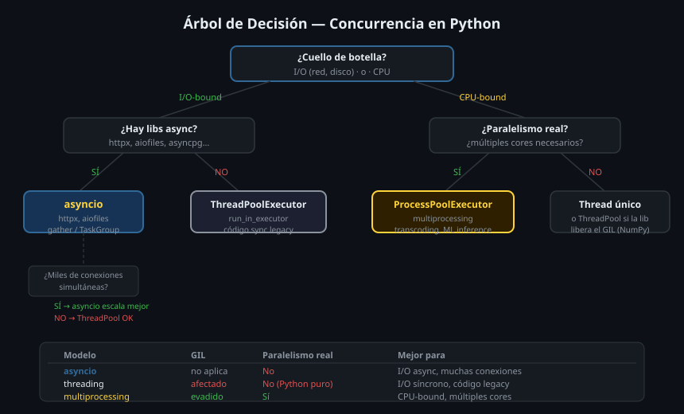

# 🧭 Cuándo Usar Cada Modelo de Concurrencia

## 🎯 Objetivos

- Entender el GIL y su impacto en threading
- Distinguir entre I/O-bound y CPU-bound
- Tomar la decisión correcta: asyncio, threading o multiprocessing

---

## 1. El GIL — Global Interpreter Lock

El GIL es un mutex interno de CPython que permite que solo **un thread ejecute bytecode Python a la vez**. Esto significa:

```
Thread 1: ████░░░░████░░░░████  (ejecutando)
Thread 2: ░░░░████░░░░████░░░░  (esperando el GIL)
           ─────────────────────
           Resultado: concurrencia, no paralelismo
```

**¿Por qué existe?** Para simplificar el manejo de memoria. La alternativa (fine-grained locking) haría CPython más lento en código single-threaded.

**Python 3.13t** (experimental) es la primera versión sin GIL. Aún no está lista para producción.

---

## 2. I/O-bound vs CPU-bound

```python
# I/O-bound — la CPU espera al mundo exterior
def download_file(url: str) -> bytes:
    return requests.get(url).content   # 99% del tiempo: esperando la red

# CPU-bound — la CPU trabaja sin parar
def compute_hash(data: bytes) -> str:
    import hashlib
    return hashlib.sha256(data).hexdigest()   # 100% CPU

# I/O-bound — el GIL se libera durante la espera
# CPU-bound — el GIL se mantiene, threads no ayudan
```

Durante operaciones I/O (red, disco, sleep), el GIL **se libera** automáticamente. Por eso threading funciona bien para I/O-bound: los threads pueden avanzar mientras los demás esperan.

---

## 3. Los tres modelos

### Threading

```python
import threading
import time

def worker(name: str) -> None:
    time.sleep(1)    # GIL liberado durante sleep
    print(f"{name} done")

threads = [threading.Thread(target=worker, args=(f"t{i}",)) for i in range(4)]
for t in threads: t.start()
for t in threads: t.join()
# ~1s total — concurrente para I/O
```

**Cuándo usar threading:**
- Código síncrono que no puede convertirse a async
- Librerías que liberan el GIL (NumPy, Pillow, algunas de C)
- Tareas de larga duración que comparten estado (GUI, callbacks)

### Multiprocessing

```python
from multiprocessing import Pool

def cpu_task(n: int) -> int:
    return sum(range(n))    # CPU pura

with Pool(processes=4) as pool:
    results = pool.map(cpu_task, [10**7] * 4)
# ~2.5× más rápido con 4 cores
```

**Cuándo usar multiprocessing:**
- Código CPU-bound (transcoding, compresión, ML inference, cálculos)
- Verdadero paralelismo en múltiples cores
- Cada proceso tiene su propio espacio de memoria

### AsyncIO

```python
import asyncio
import httpx

async def fetch(client: httpx.AsyncClient, url: str) -> bytes:
    response = await client.get(url)
    return response.content

async def main() -> None:
    async with httpx.AsyncClient() as client:
        results = await asyncio.gather(*[fetch(client, url) for url in urls])
```

**Cuándo usar asyncio:**
- Muchas operaciones I/O concurrentes (100s de conexiones HTTP)
- Código diseñado desde el inicio para ser async
- Servidores web, APIs, WebSockets
- El ecosistema async existe para lo que necesitas (httpx, aiofiles, asyncpg)

---

## 4. Árbol de decisión



```
¿El cuello de botella es I/O (red, disco) o CPU?
│
├─ I/O-bound
│   │
│   ├─ ¿Hay bibliotecas async disponibles? (httpx, aiofiles, asyncpg)
│   │   ├─ SÍ → asyncio ✅
│   │   └─ NO → ThreadPoolExecutor
│   │
│   └─ ¿Necesitas manejar miles de conexiones simultáneas?
│       ├─ SÍ → asyncio (event loop escala mejor que threads)
│       └─ NO → ThreadPoolExecutor (más simple)
│
└─ CPU-bound
    │
    ├─ ¿Necesitas verdadero paralelismo en múltiples cores?
    │   ├─ SÍ → ProcessPoolExecutor / multiprocessing
    │   └─ NO → Thread único es suficiente
    │
    └─ ¿El código lo exige NumPy / librerías que liberan el GIL?
        ├─ SÍ → ThreadPoolExecutor puede ayudar
        └─ NO → ProcessPoolExecutor
```

---

## 5. Combinando modelos (el caso real)

En producción, la respuesta casi siempre es **una combinación**:

```python
import asyncio
from concurrent.futures import ProcessPoolExecutor

# I/O async: descargar assets desde la nube
async def download_asset(name: str) -> bytes:
    async with httpx.AsyncClient() as client:
        response = await client.get(f"https://cdn.studio.bc/{name}")
        return response.content

# CPU-bound: transcodificar en proceso separado
def transcode_to_h265(data: bytes) -> bytes:
    # FFmpeg, CPU intensivo
    return process_video(data)

async def process_asset(name: str) -> None:
    loop = asyncio.get_running_loop()

    # 1. Descargar en async (I/O) — no bloquea el event loop
    raw_data = await download_asset(name)

    # 2. Transcodificar en proceso separado (CPU) — tampoco bloquea
    with ProcessPoolExecutor() as pool:
        transcoded = await loop.run_in_executor(pool, transcode_to_h265, raw_data)

    print(f"{name}: {len(transcoded)} bytes transcoded")

async def main() -> None:
    assets = ["video_01.mp4", "video_02.mp4", "video_03.mp4"]
    await asyncio.gather(*[process_asset(a) for a in assets])

asyncio.run(main())
```

---

## ✅ Resumen

| Modelo | GIL | Paralelismo real | Mejor para |
|--------|-----|-----------------|-----------|
| `threading` | Afectado | No (en Python puro) | I/O síncrono, código legacy |
| `asyncio` | No aplica (1 thread) | No | I/O async, muchas conexiones |
| `multiprocessing` | Evadido | Sí | CPU-bound, múltiples cores |
| `ThreadPoolExecutor` | Afectado | No (Python puro) | I/O síncrono en contexto async |
| `ProcessPoolExecutor` | Evadido | Sí | CPU-bound en contexto async |

---

## 📚 Recursos Adicionales

- [Python docs — threading](https://docs.python.org/3/library/threading.html)
- [Python docs — multiprocessing](https://docs.python.org/3/library/multiprocessing.html)
- [Cuándo usar asyncio vs threading (Real Python)](https://realpython.com/python-concurrency/)
